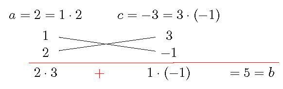

# Review of Factoring

## Can You Beat a Calculator

```{block2, type="rmdthink"}

Do you know a faster way to find the values?

1. Find the value of the polynomial $2x^3-98x$ when $x=-7$.

2. Find the value of the polynomial $x^2-9x-22$ when $x=11$.

3. Find the value of the polynomial $x^3-2x^2-9x+18$ when $x=-3$.

4. Find the value of $16^2-14^2$.

```

## Factor by Removing the GCF

***The  greatest common factor (GCF)*** of two terms is a polynomial with the **greatest coefficient** and of the **highest possible degree** that divides each term.

To ***factor a polynomial*** is to **express the polynomial as a product** of polynomials of lower degrees. The first and the easiest step is to factor out the GCF of all terms.

```{example}  

Factor $4x^3y-8x^2y^2+12x^3y^3$.

```

```{solution}  

1. Find the GCF of all terms.  
   The GCF of $4x^3y$, $-8x^2y^2$ and $12x^4y^3$ is $4x^2y$.

2. Write each term as the product of the GCF and the remaining factor.  
   $4x^3y=(4x^2y)\cdot x$, $-8x^2y^2=(4x^2y)\cdot (-2y)$, and $12x^4y^3=(4x^2y)(3xy^2)$.

3. Factor out the GCF from each term.  
   $4x^3y-8x^2y^2+12x^3y^3=4x^2y\cdot(x-2y+3xy^2)$.

```

## Factor by Grouping

For a four-term polynomial, in general, we will group them into two groups and factor out the GCF for each group and then factor further.

```{example}

Factor $2x^2-6xy+xz-3yz$.

```

```{solution}  

1. Group the first two terms and the last two terms.
   $$
    \begin{aligned}
    &2x^2-6xy+xz-3yz\\
    =&(2x^2-6xy)+(xz-3yz)
    \end{aligned}
   $$
   
2. Factor out the GCF from each group.  
   $$
    \begin{aligned}
    =&2x(x-3y)+z(x-3y)
    \end{aligned}
   $$

3. Factor out the binomial GCF.
$$
\begin{aligned}
=&(x-3y)(2x+z).
\end{aligned}
$$

```

```{example}

Factor $ax+4b-2a-2bx$.

```

```{solution}  

1. Group the first term with the third term and group the second term with the last term.
$$
\begin{aligned}
&ax+4b-2a-2bx\\
=&(ax-2a)+(-2bx+4b)
\end{aligned}
$$

2. Factor out the GCF from each group.
$$
\begin{aligned}
=&a(x-2)+(-2b)(x-2)
\end{aligned}
$$

3. Factor out the binomial GCF.
$$
\begin{aligned}
=&(x-2)(a-2b).
\end{aligned}
$$

```

```{block2, type="rmdtip"}

**Guess and check.**  
Once you factored one group, you may expect that the other group has the same binomial factor so that factoring may be continued.

```

## Factor Difference of Powers

Factoring is closely related to solving polynomial equations. If a polynomial equation $p(x)=0$ has a solution $r$, then $p(x)$ has a factor $x-r$. For example, $x^n-r^n=0$ has a solution $x=r$. So the difference $x^n-r^n$ has a factor $(x-r)$. Using long division or by induction, we obtain the following equality.

**Difference of $n$-th powers**

$$a^n-b^n=(a-b)(a^{n-1}+a^{n-2}b+\cdots +ab^{n-2}+b^{n-1})$$

In particular,

$$a^2-b^2=(a-b)(a+b).$$

```{example}

Factor $25x^2-16$.

```

```{solution}

1. Recognize the binomial as a difference of squares.
$$\begin{aligned}
&25x^2-16\\
=&(5x)^2-4^2
\end{aligned}
$$

2. Apply the formula.
$$
\begin{aligned}
=&(5x-4)(5x+4).
\end{aligned}
$$

```

```{example}

Factor $32x^3y-2xy^5$ completely.

```

```{solution}

$$
32x^3y-2xy^3=2xy(16x^2-y^4)=2xy((4x)^2-(y^2)^2)=2xy(4x+y^2)(4x-y^2).
$$

```

## Factor Trinomials

If a trinomial $ax^2+bx+c$, $A\neq 0$, can be factored, then it can be expressed as a product of two binomials: 
$$ax^2+bx+c=(mx+n)(px+q).$$
By simplify the product using the FOIL method and comparing coefficients, we observe that 
$$
a=\underbrace{mn}_{\mathrm{F}}\quad\quad\quad
b=\underbrace{mq}_{\mathrm{O}}~\underset{+}{\underset{}{+}}~\underbrace{np}_{\mathrm{I}}
\quad\quad\quad 
c=\underbrace{nq}_{\mathrm{F}}
$$

A trinomial $ax^2+bx+c$ is also called a ***quadratic polynomial***. The function defined by $f(x)=ax^2+bx+c$ is called a ***quadratic function***.

```{block2, type="rmdtip"}

**Trial and error.**  
The observation suggests to use trial and error to find the undetermined coefficients $m$, $n$, $p$, and $q$ from factors of $a$ and $c$ such that the sum of cross products $mq+np$ is $b$. A diagram as shown in the following examples will be helpful to check a trial.

```

```{example}

Factor $x^2+6x+8$.

```

```{solution}

1. Factor $a=1$:
   $$1=1\cdot 1.$$

2. Factor $c=8$:
   $$8=1\cdot 8=2\cdot 4.$$

3. Choose a proper combination of pairs of factors and check if the sum of cross product equals $b=6$:
   $$1\cdot 4+ 1\cdot 2=6.$$  
   This step can be checked easily using the following diagram.  
   {width=60%}

4. Factor the trinomial
    $$x^2+6x+8=(x+2)(x+4).$$

```

```{example}

Factor $2x^2+5x-3$.

```

```{solution}

1. Factor $a=2$:
   $$1=1\cdot 2.$$

2. Factor $c=-3$:
   $$-3=1\cdot (-3)=(-1)\cdot 3.$$

3. Choose a proper combination of pairs of factors and if the sum of cross products equals $b=5$:  
   $$2\cdot 3+1\cdot(-1)=5.$$  
   This step can be checked easily using the following diagram.  
   {width=60%}  

4. Factor the trinomial
   $$2x^2+5x-3=(x+3)(2x-1).$$

```

```{block2, type="rmdtip"}

**Use Auxiliary Problem.**  
Some higher degree polynomials may be rewrite as a trinomial after a  substitution. Factoring the trinomial helps factor the polynomial.

```

```{example}

Factor the trinomial completely.

$$4x^4-x^2-3$$

```

```{solution}

1. Let $x^2=y$. Then $4x^4-x^2-3=4y^2-y-3$.

2. Factor the trinomial in $y$:   $4y^2-y-3=(4y+3)(y-1)$.

3. Replace $y$ by $x^2$ and factor further.
$$
    \begin{split}
        4x^4-x^2-3&=4y^2-y-3\\
        &=(4y+3)(y-1)\\
        &=(4x^2+3)(x^2-1)\\
        &=(4x^2+3)(x-1)(x+1).
    \end{split}
$$

```

## Practice

```{exercise}

Factor out the GCF.

1. $18x^2y^2-12xy^3-6x^3y^4$
1. $5x(x-7)+3y(x-7)$
1. $-2a^2(x+y)+3a(x+y)$

```

```{exercise}

Factor by grouping.

1. $12xy-10y+18x-15$
1. $12ac-18bc-10ad+15bd$
1. $5ax-4bx-5ay+4by$

```

```{exercise}

Factor completely.

1. $25x^2-4$
1. $8x^3-2x$
1. $25xy^2+x$

```

```{exercise}

Factor completely.

1. $3x^3+6x^2-12x-24$
1. $x^4+3x^3-4x^2-12x$

```

```{exercise}

Factor the trinomial.

1. $x^2+4x+3$
2. $x^2+6x-7$
3. $x^2-3x-10$

```

```{exercise}  

Factor the trinomial.

1. $5x^2+7x+2$
2. $2x^2+5x-12$
3. $3x^2-10x-8$

```

```{exercise}  

Factor completely into polynomials with integer coefficients.

1. $x^3-5x^2+6x$
2. $4x^4-12x^2+5$
3. $2x^3y-9x^2y^2-5xy^3$

```
