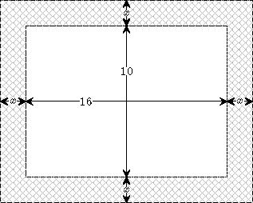

# (PART\*) Part 2: Equations and Applications {-}

# Solving Polynomial Equations by Factoring

## Handshaking Problem

::: {.rmdthink}

In meeting room, a group of people all shook hands with one another. In total, 15 handshakes occurred. Do you know how many people in the group?

:::

## Properties of Equations

An ***equation*** is an statement that asserts an equality containing unknown variables. For example, $2x+3=1$ is an equation of the unknown variable $x$.  
Equations often contain variables other than the unknowns. Those variables, which are assumed to be known, are usually called ***constants***, ***coefficients*** or ***parameters***. For example, in the linear equation $ax+b=c$ of (the unknown) $x$, the variables $a$, $b$ and $c$ are referred as known coefficients or constants.  
An ***identity*** is an equation that is true for all possible values of the variable(s) it contains. For example, $x^2-y^2=(x+y)(x-y)$ is an identity.  
***Solving an equation*** consists of determining values of the variables that make the equality true. Two equations are said to be ***equivalent*** if and only if they have the same solution set, that is, a solution of one equation is also a solution of the other equation. For example $2x-6=0$ and $x-1=2$ are equivalent.

::: {.rmdnote}

When solving an equation, the following operations can be used to transform an equation to an equivalent one:

- Adding or subtracting the same quantity to both sides of an equation. For example, $x-1=2$ is equivalent to $x-1+1=2+1$.
- Multiplying or dividing both sides of an equation **by a non-zero quantity**. For example $2x=4$ is equivalent to $\frac{2x}{2}=\frac{4}{2}$.
- Applying an identity to transform one side of the equation. For example, $x^2-1=0$ is equivalent to $(x-1)(x+1)=0$, where the identity $x^2-1=(x-1)(x+1)$ was applied.

In general, one may apply any choice of a function to both sides of the equation to make a transformation. The resulting equation still has the solutions of the original equations as it solutions. However, the resulting equation may also have some extra solutions which are called ***extraneous solutions***. For example, taking squares of both sides of the equation $x=1$ produces the equation $x^2=1$. The new equation $x^2=1$ has two solutions $x=-1$ and $x=1$, but the original equation $x=1$ only has one solution. The solution $x=-1$ of the equation $x^2=1$ is an extraneous solution of the equation $x=1$.

:::

## Quadratic Equations

A **polynomial equation** is an equation that can be written in the form
$$
a_{n}x^{n}+a_{n-1}x^{n-1}+\cdots+a_{2}x^{2}+a_{1}x+a_{0}=0,
$$
where $n$ is a positive integer and $a_n\ne 0$.

A polynomial equation is called a ***quadratic equation*** if $n=2$. For example, $2x^2+5x-3=0$. We often write a quadratic equation in its ***standard form***
$$a x^2+bx+c=0,$$
where $a$, $b$ and $c$ are numbers, and $a\neq 0$.

When solving linear equations, arithmetic operations are enough. In general, one may need to use identity or functional operation. Factoring is one of those frequently used identity operation. Indeed, to solve a problem, a general strategy is to to reduce the original problem to easier problems. Using factoring and the ***zero product property***:
$$A\cdot B=0 \quad ~~\text{if and only if}~~  \quad A=0 ~~\text{or}~~ B=0,$$
one can transform a polynomial equation into smaller degree polynomial equations. In particular, if $ax^2+bx+c=(mx-p)(nx-q)$, then a solution of the quadratic equation $ax^2+bx+c=0$ is a solution of either $mx-p=0$ or $nx-q=0$.

:::{.example}

Solve the equation
$$2x^2+5x=3.$$

:::

:::{.solution}
\

1. Rewrite the equation into "*Expression*=0" form and factor.
    $$
    \begin{aligned}
        2x^2+5x&=3\\
        2x^2+5x-3&=0\\
        (2x-1)(x+3)&=0
    \end{aligned}
    $$
2. Apply the zero product property.
    $$2x-1=0\quad\text{or}\quad x+3=0.$$
3. Solve each equation.
    $$
    \begin{aligned}
        2x-1 =0       & \qquad\text{or} & x+3 =0  \\
        2x   =1       &    & x   =-3 \\
        x    =\frac12 & \qquad\text{or} & x   =-3
    \end{aligned}
    $$

4. The solution set is $\{-3, \frac12\}$.

:::

:::{.example}

Solve the equation
$$(x-2)(x+3)=-4.$$

:::

:::{.solution}
\

1. Rewrite the equation into "*Expression*=0" form and factor.
    $$
    \begin{aligned}
        (x-2)(x+3)&=-4\\
        x^2+x-6&=-4\\
        x^2+x-2&=0\\
        (x-1)(x+2)&=0
    \end{aligned}
    $$
1. Apply the zero product property.
    $$x-1=0\quad\text{or}\quad x+2=0.$$
1. Solve each equation.
    $$
    \begin{aligned}
        x-1 =0 & \qquad\text{or} & x+2 =0  \\
        x   =1 & \qquad\text{or} & x   =-2
    \end{aligned}
    $$
1. The solution set is $\{-2, 1\}$.

:::

:::{.example}

A rectangular garden is surrounded by a path of uniform width. If the dimension of the garden is  $10$ meters by $16$ meters and the total area is 216 square meters, determine the width of the path.

{width=30%}\

:::

:::{.solution}
\

1. Suppose that the width of the frame is $x$ meters. Translate given information into expressions in $x$ and build an equation.\
Total Width: $2x+10$ \ Total Length: $2x+16$\
Width $\times$ Length=Total Area:
$$(2x+10)(2x+16)=216.$$
1. Solve the equation.
    $$
    \begin{aligned}
        (2x+10)(2x+16)&=216\\
        4x^2+52x+160&=216\\
        4x^2+52x-56&=0\\
        x^2+13x-14&=0\\
        (x+14)(x-1)&=0
    \end{aligned}
    $$
    $$
    x = -14\quad \text{or}\quad x = 1
    $$
1. So the width of the path is $1$ meter.

:::

::: {.rmdtip}

**Understand the Problem**  
When solving a word problem, you may first outline what's known and what's unknown, and restate the problem using algebraic expressions. Once you reformulated the problem algebraically, you may solve it using your mathematical knowledge.

:::

\newpage

## Practice

:::{.exercise}

Solve the equation by factoring.

1. $x^2-3x+2=0$
2. $2x^2-3x=5$
3. $(x-1)(x+3)=5$
4. $\frac13(2-x)(x+5)=4$

:::

:::{.exercise}

Find all real solutions of the equation by factoring.

1. $4(x-2)^2-9=0$
1. $2x^3-18x=0$
1. $3x^4-2x^2=1$
1. $x^3-3x^2-4x+12=0$

:::

:::{.exercise}

A paint measuring $3$ inches by $4$ inches is surrounded by a frame of uniform width. If the combined area of the paint and the frame is $30$ square inches, determine the width of the frame.

{width=30%}\

:::

:::{.exercise}

A rectangle whose length is $2$ meters longer than its width  has an area $8$ square meters. Find the width and the length of the rectangle.

:::

:::{.exercise}

The product of two **consecutive negative odd** numbers is $35$. Find the numbers.

:::

:::{.exercise}

In a right triangle, the long leg is 2 inches more than double of the short leg. The hypotenuse of the triangle is 1 inch longer than the long leg. Find the length of the shortest side.

:::

:::{.exercise}

A ball is thrown upwards from a rooftop. It will reach a maximum vertical height and then fall back to the ground. The height $h(t)$ of the ball from the ground after time $t$ seconds is $h(t)=-16t^2 + 48t + 160$ feet. How long it will take the ball to hit the ground?

:::

:::{.exercise}

A toy factory estimates that the demand of a particular toy is  $300 -x$ units each week if the price is \$$x$ dollars per unit. Each week there is a fixed cost \$40,000 to produce the demanded toys.
The weekly revenue is a function of the price given by $R(x)=x(30-x)$

1. Find the function that models the weekly revenue, $R$, received when the selling price is \$$x$ per unit.
2. What the price range so the the revenue is nonnegative.

:::
