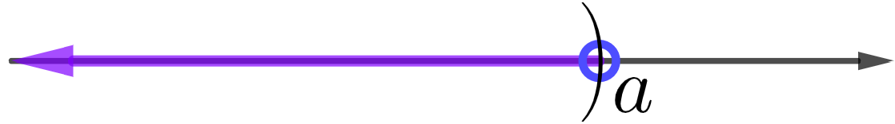
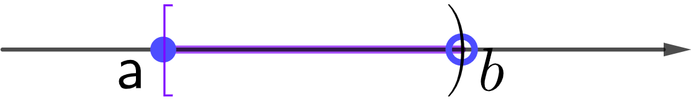

# Linear Inequalities

## Know the Grade You Must Earn

```{block2, type="rmdthink"}
A course has three types of assessments: homework, monthly test and the final exam. The grading policy of the course says that homework counts 20%, monthly test counts 45% and the final exam counts for 35%. At the last day of class a student wants to know the minimum grade needed on the final to get a grade C or better, equivalently, overall grade 74 or above. The student earned 100 on homework and 80 on monthly test.

1. What the minimum grade the student must earn on the final to get a C or better?
2. If, in addition, the final exam must be at least 55 to earn a C or better, what would be the minimum grade needed?

```

```{block, type="rmdthink"}
The college student has attempted 30 credits and a cumulated GPA 1.8. To graduate from the college, the GPA must be 2.0 or higher and the total credits must be at least 60. Now the student decides to spend more time on studying and aims at an cumulated GPA 2.5 on further courses.  
How many more attempted credits the student must earn to graduate?

**Cumulated GPA = $\dfrac{\text{Total Quality Points Earned}}{\text{Total Attempted Credits}}$**

**Total Quality Points Earned = Sum of $\text{Credits Attempted}\times \text{Grade Value}$**

```

## Properties and Definitions

### Properties of Inequalities {-}

An inequality defines a relationship between two expressions. The following properties show when the inequality relationship is preserved or reversed.

|Property| Example |
|:---|:---|
|**The additive property** <br/>  If $a<b$, then $a+c<b+c$, for any real number $c$. <br/> If $a<b$, then $a-c<b-c$,  for any real number $c$. |If $x+3<5$, then $x+3-3<5-3$. <br/> Simplifying both sides, we get $x<2$.|
|**The positive multiplication property**  <br/> If $a<b$ and $c$ is positive, then $ac<bc$. <br/>   If $a<b$ and $c$ is positive, then $\frac ac<\frac bc$. |If $2x<4$, then $\frac{2x}{2}<\frac{4}{2}$. <br/>  Simplifying both sides, we get $x<2$.|
|**The negative multiplication property**  <br/> If $a<b$ and $c$ is negative, then $ac>bc$.  <br/>  If $a<b$ and $c$ is negative, then $\frac ac>\frac bc$. |If $1<2$, then $-2=1\cdot(-2)>2\cdot(-2)=-4$. <br/>  If $-2x<4$, then $\frac{-2x}{-2}>\frac{4}{-2}$.  <br/>  Simplifying both sides, we get $x>2$.|

```{block2, type="rmdnote"}
These properties also apply to $a\leq b$, $a>b$ and $a\geq b$.
```

```{block2, type="rmdnote"}
It's always better to view $a-c$ as $a+(-c)$. Because addition has the commutative property.
```

### Compound Inequalities {-}

A ***compound inequality*** is formed by two inequalities with the word  *and* or the word *or*. For examples, the following are three commonly seen type compound inequalities:
$$
x-1>2\quad \text{and} \quad 2x+1<3,
$$
$$
3x-5<4\quad \text{or} \quad 3x-2>10,
$$
$$
-3\leq \frac{2x-4}{3}<2.
$$
The third compound inequality is simplified expression for the compound inequality $-3\leq \frac{2x-4}{3}$ and $\frac{2x-4}{3}<2$.

### Interval Notations {-}

Solutions to an inequality normally form an interval which has boundaries and should reflect inequality signs. Depending on the form of  an inequality, we may a single interval and a union of intervals. For example, suppose $a<b$, we have the following equivalent representations of inequalities.

| $x<a$ |$x\ge b$ |$a\le x<b$ |$x\le a$ or $x>b$ |
|:---:|:---:|:---:|:---:|
| {max-width=10%} | {max-width=10%} |{max-width=10%} | {max-width=10%}|
|$(-\infty, a)$|$[b,\infty)$|$[a, b)$|$(-\infty, a]\cup (b,\infty)$|

## Examples

```{block2, type="rmdtip"}
**Think backward.** To solve a problem, knowing what to expect helps you narrow down the gap step by step by comparing the goal and your achievement.

An inequality (equation) is solved if the unknown variable is isolated. That's what to be expected. To isolate the unknown variable, you use comparisons to determine what mathematical operations should be applied. When an operation is applied to one side, the same operation should also be applied to the other side. For inequalities, we also need to determine whether the inequality sign should be preserved or reversed according to the operation.
```

```{example}
Solve the linear inequality
$$
2x+4>0.
$$
```

```{solution}
$$
\begin{aligned}
&  & 2x+4 & >0  \\
    \text{add $-4$}      &  & 2x   & >-4 \\
    \text{divide by $2$} &  & x    & >-2
\end{aligned}
$$
The solution set is $(-2, \infty)$.
```

```{example}
Solve the linear inequality 
$$
-3x-4<2.
$$
```

```{solution}
$$
\begin{aligned}
                                        &  & -3x-4 & <2       \\
    \text{add $4$}                   &  & -3x   & <6  &  & \\
    \text{divide by $-3$ and switch} &  & x     & >-2
\end{aligned}
$$
The solution set is $(-2, +\infty)$.
```

```{example}
Solve the compound linear inequality 
$$
x+2<3\quad \text{and}\quad -2x-3<1.
$$
```

```{solution}
$$
\begin{aligned}
    x+2 & <3 &  & \text{and} & -2x-3 & <1  \\
    x   & <1 &  &            & -2x   & <4  \\
    x   & <1 &  & \text{and} & x     & >-2
\end{aligned}
$$
That is $-2<x<1$. The solution set is $(-2, 1)$.
```

```{example}
Solve the compound linear inequality  
$$
-x+4>2 \quad \text{or} \quad 2x-5\geq -3.
$$
```

```{solution}
$$
\begin{aligned}
    -x+4 & >2  &  & \text{or} & 2x-5 & \geq -3 \\
    -x   & >-2 &  &           & 2x   & \geq 2  \\
    x    & <2  &  & \text{or} & x    & \geq 1
\end{aligned}
$$
That is $x\geq 1$ or $x< 2$. The solution set is $(-\infty, +\infty)$.
```

```{example}
Solve the compound linear inequality
$$
-4\leq\dfrac{2x-4}{3}<2.
$$
```

```{solution}
$$
\begin{array}{rcl}
    -4\leq  & \dfrac{2x-4}{3}    & <2  \\
    -12\leq & 2x-4         & <6  \\
    -8\leq  & 2x                & <10 \\
    -4\leq  & x               & <5  
\end{array}
$$
The solution set is $[-4, 5)$.
```

```{example}
Solve the compound linear inequality
$$
-1\leq \dfrac{-3x+4}{2}<3.
$$
```

```{solution}
$$
\begin{array}{rcl}
    -1\leq & \frac{-3x+4}{2}  & <3        \\
    -2\leq & -3x+4          & <6        \\
    -6\leq & -3x           & <2        \\
    2\geq  & x            & >-\frac23
\end{array}
$$
The solution set is $(-\frac23, 2]$.
```

```{example}

Suppose that $-1\le x < 2$. Find the range of $5-3x$. Write your answer in interval notation.

```

```{solution}

To get $5-3x$ from $x$, we need first multiply $x$ be $-3$ and then add $5$.
$$
\begin{array}{rcl}
-1\leq & x          & < 2        \\
3\geq & -3x         & >-6        \\
8\geq & 5-3x      & >-1
\end{array}
$$
The range of $5-3x$ is $(-1, 8]$.

```

```{block2, type="rmdtip"}

**Understand the Problem.** Understanding the known, the unknown and the condition of the given problem is the key to solve the problem. Normally, by comparing the known and unknown, you will find the way to solve the problem.

```

## Practice

```{exercise}

Solve the linear inequality. **Write your answer in interval notation.**

1. $3x + 7 \leq 1$
2. $2x-3>1$

```

```{exercise}

Solve the linear inequality. **Write your answer in interval notation.**

1. $4x + 7 > 2x-3$
2. $3-2x \le x-6$

```

```{exercise}

Solve the compound linear inequality. **Write your answer in interval notation.**

1. $3x+2>-1 ~\text{and}~ 2x-7\leq 1$
2. $4x -7< 5 ~\text{and}~ 5x-2\geq 3$

```

```{exercise}

Solve the compound linear inequality. **Write your answer in interval notation.**

1.  $-4\leq 3x+5<11$
2.  $7\geq 2x-3\geq -7$

```

```{exercise}

Solve the compound linear inequality. **Write your answer in interval notation.**

<div class="row">
1.  $3x-5>-2 ~\text{or}~ 10-2x\leq 4$
2.  $2x + 7<5 ~\text{or}~ 3x-8\geq x-2$
</div>


```

```{exercise}

Solve the compound linear inequality. **Write your answer in interval notation.**

1.  $-2\leq \dfrac{2x-5}{3}<3$
1.  $-1< \dfrac{3x+7}{2}\leq 4$

```

```{exercise}

Solve the linear inequality. **Write your answer in interval notation.**
$$
\frac13x+1<\frac12(2x-3)-1
$$

```

```{exercise}

Solve the compound linear inequality. **Write your answer in interval notation.**
$$
0\le \frac25-\frac{x+1}{3}< 1
$$

```

```{exercise}

Suppose $0< x \le 1$. Find the range of $-2x+1$. **Write your answer in interval notation.**

```

```{exercise}

Suppose that $x+2y=1$ and $1\leq x< 3$. Find the range of $y$. **Write your answer in interval notation.**

```

```{exercise}

A toy store has a promotion “Buy one get the second one half price" on a certain popular toy. The sale price of the toy is \$20 each. Suppose the store makes more profit when you buy two. What do you think the store's purchasing price of the toy is?

```
