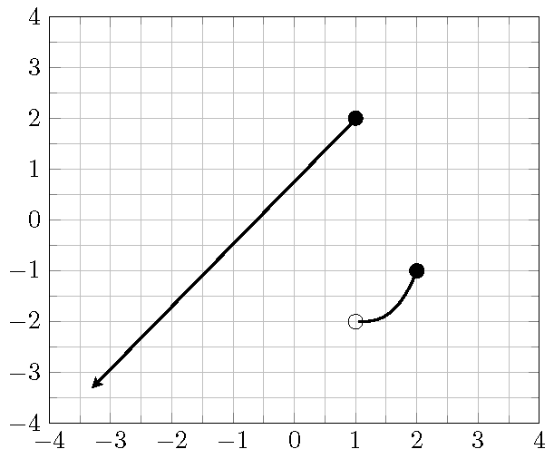

# (PART\*) Part 3: Functions and Applications {-}

# Introduction to Functions

## Functions as Relations

A ***relation*** is a set of ordered pairs. The set of all first components of the ordered pairs is called the ***domain***. The set of all second components of the ordered pairs is called the ***range***.

A ***function*** is a relation such that each element in the domain corresponds to **exactly one** element in the range.

## Function Notation

For a function, we usually use the variable $x$ to represent an element from the domain and call it the ***independent variable***. The variable $y$ is used to represent the value  corresponding to $x$ and is called the ***dependent variable***. We say $y$ is a function of $x$. When we consider several functions together, to distinguish them we named functions by a letter such as $f$, $g$, or $F$. The notation $f(x)$, read as **"$f$ of $x$" or "$f$ at $x$"**, represents the output of the function $f$ when the input is  $x$.
To find the value of a function at a given number, we substitute the independent variable $x$ by the given number and then evaluate the expression. We call the procedure evaluating a function.

```{example}

Find the indicated function value.

1. $f(-2)$,\ $f(x)=2x+1$
2. $g(2)$,\ $g(x)=3x^2-10$
3. $h(a-t)$,\ $h(x)=3x+5$.

```

```{solution}
\

1. $f(-2)=2\cdot(-2)+1=-4+1=-3$.
2. $g(-2)=3\cdot(2^2)-10=3\cdot 4-10=12-10=2$.
3. $h(a-t)=3\cdot(a-t)+5=3a-3t+5$.

```

## Graphs of Functions

***The graph of a function*** is the graph of its ordered pairs.
A graph of ordered pairs $(x,y)$ in the rectangular system defines $y$ as a function of $x$ if any vertical line crosses the graph at most once. This test is called the ***vertical line test***.

## Domain and Range

The domain of a graph is the set of all inputs ($x$-coordinates). The range of a graph is the set of all outputs ($y$-coordinates).
To find the domain of a graph, we look for the left and the right endpoints. To find the range of a graph, we look for the highest and the lowest positioned points.

```{example}

Use the graph in the picture to answer the following questions.

1. Determine whether the graph is a function and explain your answer.  
1. Find the domain (in interval notation) of the graph.  
1. Find the range (in interval notation) of the graph.  
1. Find the interval where the graph is above $2$.  
1. Find the interval where the graph is is decreasing.  
2. Find all maximum and minimum values of the function if they exist.  
3. Find the value of $x$ such that $(x, 0)$ is on the graph.

{width=60%}\

```

```{solution}
\

1. The graph is a function. Because every vertical line crosses the graph at most once.  
2. The graph has the left endpoint  at $(-2, -2)$ and but no right endpoint. So the domain is $[-2, +\infty)$.  
3. The graph has a lowest positioned point $(-2, -2)$ but no highest positioned point. So the range is $[-2, +\infty)$.  
4. The graph is above 2 over the interval $(3, \infty)$.  
5. The graph is decreasing over the interval $(1,2)$.  
6. The graph has minima at $(-2,1)$ and $(2,1)$.  
7. The point $(x, 0)$ is on the $x$-axis. If $x=-0.5$, then it will be on the graph.

```

## Practice

```{exercise}

Find the indicated function values for the functions $f(x)=-x^2+x-1$ and  $g(x)=2x-1$. Simplify your answer.

1. $f(2)$
1. $f(-x)$
1. $g(-1)$
1. $g(f(1))$

```

```{exercise}

Suppose $g(x) = -3x + 1$.

1. Compute $\dfrac{g(4)-g(1)}{4-1}$
1. Compute $\dfrac{g(x+h)-g(x)}{h}$

```

```{exercise}

Suppose the domain of the linear function $l(x)=1-2x$ is $(0, 1)$. Find the range of the function.

```

```{exercise}

Use the graph in the picture to answer the following questions.

1. Determine whether the graph is a function and explain your answer.
2. Find the domain of the graph (write the domain in interval notation).
3. Find the range of the graph (write the range in interval notation).
4. Find the interval where the graph is above the $x$-axis.
5. Find all points where the graph reaches a maximum or a minimum.
6. Find the values of the $x$-coordinate of all points on the graph whose $y$-coordinate is $1$.

{width=60%}\

```

```{exercise}

Use the graph of the function $f$ in the picture to answer the following questions.

1. Find the $y$-intercept.
2. Find the value
   $$\dfrac{f(3)-f(0)}{3}.$$
3. Find the values $x$ such that $f(x)=0$.
4. Find the solution to the inequality $f(x)>0$. Write in interval notation.

{width=60%}\

```

```{exercise}

Today Matt drove from home to school in 30 minutes. He spent 6 minutes on  local streets before driving on the highway and 4 minutes on local streets towards school after getting off the highway. On local streets, his average speed is 30 miles per hour. On the highway, his average speed is 60 miles per hours.

1. Write the distance $d$ (in miles) he drove as a function of the time $t$ (in minutes)?
1. After 15 minutes, where was he and how far did he drive?
1. How far did he drive from home to school?

```
