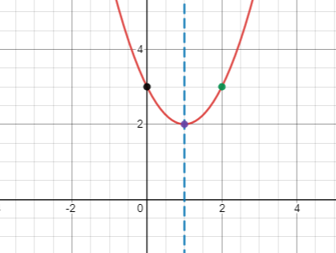
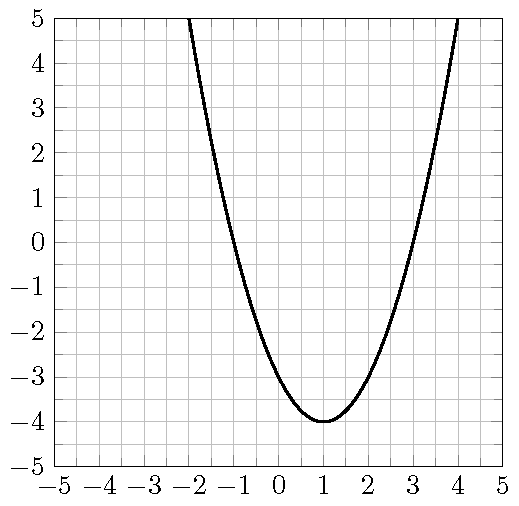
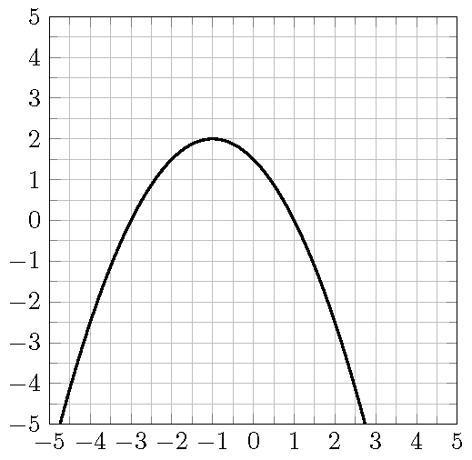

# Quadratic Functions

## Maximize the Revenue

::: {.rmdthink}

When price increases, demand decreases and vice verse. A retail store found that the price $p$ as a function of the demand $x$ for a certain product is $p(x)=100-\frac12 x$. The revenue $R$ of selling $x$ units is $R=x\cdot p(x)=x(100-\frac12x)$. To maximize the revenue, what should be the price?

:::

## The Graph of a Quadratic Function

The graph of a quadratic function $f(x)=ax^2+bx+c$, $a\neq 0$, is called a ***parabola***.

By completing the square, a quadratic function $f(x)=ax^2+bx+c$ can always be written in the form $f(x)=a(x-h)^2+k$, where $h=-\dfrac{b}{2a}$ and $k=f(h)=f\left(-\dfrac{b}{2a}\right)$.

1. The line $x=h=-\dfrac{b}{2a}$ is called the ***axis of symmetry*** of the parabola.
2. The point $(h, k)=\left(-\dfrac{b}{2a}, f\left(-\dfrac{b}{2a}\right)\right)$ is called the ***vertex*** of the parabola.

## The Minimum or Maximum of a Quadratic Function

Consider the quadratic function $f(x)=ax^2+bx+c$, $a\neq 0$.

1. If $a>0$, then the parabola opens upward and $f$ has a minimum  $f\left(-\dfrac{b}{2a}\right)$ at the vertex.
1. If $a<0$, then the parabola opens downward and $f$ has a maximum  $f\left(-\dfrac{b}{2a}\right)$ at the vertex.

## Intercepts of a Quadratic Function

Consider the quadratic function $f(x)=ax^2+bx+c$, $a\neq 0$.

1. The $y$-intercept is $(0, f(0))=(0, c)$.
1. The $x$-intercepts, if exist, are the solutions of the equation $ax^2+bx+c=0$.

:::{example}

Find the axis of symmetry and the vertex of the quadratic function $f(x)=x^2-4x+5$.

:::

:::{solution}

1. The coefficients are $a=1$, $b=-4$ and $c=5$.
   Then the axis of symmetry is
   $$x=-\frac{b}{2a}=-\frac{-4}{2\cdot 1}=2.$$

2. The vertex is given by 
   $$(-\frac{b}{2a}, f(-\frac{b}{2a}))=(2, f(2))=(2, 1).$$

:::

:::{example}

Find the axis of symmetry and the vertex of the quadratic function $f(x)=2(x-1)^2-1$.

:::

:::{solution}

1. The equation is in the perfect square form $f(x)=a(x-h)^2+k$. In this case, $h=1$ and $k=-1$.
   Then the axis of symmetry is
   $$x=h=1.$$

2. The vertex is given by
   $$(h, k)=(1, -1).$$

:::

:::{example}

Sketch the graph of the quadratic function $f(x)=x^2-2x+3$.

:::

:::{solution}

1. The line of symmetry is
   $$x=-\frac{b}{2a}=-\frac{-2}{2\cdot 1}=1.$$

2. The vertex is
   $$(-\frac{b}{2a}, f(-\frac{b}{2a}))=(1, f(1))=(1, 2).$$

3. Since $k=f(1)>0$ and $a=1>0$, the parabola is above the $x$-axis and there is no $x$-intercept.

4. The $y$-intercept is
   $$(0, f(0))=(0, c)=(0, 3).$$

5. To have a better graph, find an additional point on it, say
   $$(2, f(2))=(2, 3).$$

6. Using the above information to sketch the graph.

:::

:::{example}

Does the function $f(x)=2x^2-4x-6$ have a maximum or minimum? Find it.

:::

:::{solution}
\

1. Since $a>2$, the function opens upward and has a minimum.
1. Find the line of symmetry $x=\frac{-b}{2a}$:
    $x=\frac{-(-4)}{2\cdot 2}=1$.
1. Find the minimum by plugging $x=1$ into the function $f$.
    The minimum is
    $$
    f(-\frac{b}{2a})=f(1)=2-4-6=-8.
    $$

:::

:::{example}

Consider the function $f(x)=-x^2+3x+6$. Find values of $x$ such that $f(x)=2$.

:::

:::{solution}
\

1. Set up the equation for $x$.
    \[-x^2+3x+6=2\]
1. Solve the equation $-x^2+3x+6=2$, we get $x=-1$ or $x=4$.
The values of $x$ such that $f(x)=2$ are $x=-1$ and $x=44$.

:::

:::{example}

A quadratic function $f$ whose the vertex is $(1, 2)$ has a $y$-intercept $(0, -3)$. Find the equation that defines the function.

:::

:::{solution}
\

1. Write down the general form of $f$ using only the vertex.
    Quadratic functions with the vertex at $(1,2)$ are defined by $y=a(x-1)^2+2$, where $a$ is a nonzero real number.
1. Determine the unknown $a$ using the remaining information.
   Since $(0, -3)$ is on the graph of the function, the number $a$ must satisfy the equation  $-3=a(0-1)^2+2$.
2. Solving for $a$ from the equation, we get $a=-5$.
    The quadratic function $f$ is given by $f(x)=-5(x-1)^2+2$.

:::

\newpage

## Practice

:::{exercise}

Sketch the graph of the quadratic functions $f(x)=-(x-2)^2+4$ and find

1. the coordinates of the $x$-intercepts,
2. the coordinates of the $y$-intercept,
3. the equation of the axis of symmetry,
4. the coordinates of the vertex.
5. the interval of $x$ values such that $f(x)\geq 0$.

:::

:::{exercise}

Sketch the graph of the quadratic functions $f(x)=x^2+2x-3$ and find

1. the coordinates of the $x$-intercepts,
1. the coordinates of the $y$-intercept,
1. the equation of the axis of symmetry,
1. the coordinates of the vertex.
1. the interval of $x$ values such that $f(x)>0$.

:::

:::{exercise}

Consider the parabola in the graph.

1. Determine the coordinates of the $x$-intercepts.
2. Determine the coordinates of the $y$-intercept.
3. Determine the coordinates of the vertex.
4. For what values of $x$ is $f(x)=-3$.
5. Find an equation for the function.

{width=60%}\

:::

:::{exercise}

Consider the graph of the function $f$ shown in the picture.

1. Determine the coordinates of the $x$-intercepts.
2. Determine the coordinates of the $y$-intercept.
3. Determine the coordinates of the vertex.
4. Find the domain of the function.
5. Find the range of the function.
6. For what values of $x$ is $f(x)=\frac{3}{2}$.
7. Over which interval is the function $f$ positive.
8. Over which interval is the function $f$ decreasing.
9. Find an additional point on the graph.
10. Find an equation for the function.

{width=60%}\

:::

:::{exercise}

Consider the quadratic functions $g(x)=x^2-3x-4$ and find the following values or intervals

1. the coordinates of all intercepts
1. the coordinates of the vertex
1. the equation and graph of the axis of symmetry
1. the domain and range in interval notation
1. the coordinates of an additional point on the graph
1. the maximum or minimum value
1. the value at which the max or min is reached
2. the interval over which the function is negative
3. the interval over which the function is positive
4. the interval over which the function is increasing.

:::{exercise}

A store owner estimates that by charging $x$ dollars each for a certain cell phone case, he can sell $d(x)=40 - x$ phone cases each week. The revenue in dollars is $R(x)=xd(x)$ when the selling price of a computer is $x$, Find the selling price that will maximize revenue, and then find the amount of the maximum revenue.

:::

:::{exercise}

A ball is thrown upwards from a rooftop. It will reach a maximum vertical height and then fall back to the ground. The height $h(t)$ of the ball from the ground after time $t$ seconds is $h(t)=-16t^2 + 48t + 160$ feet.

1. When will the toy rocket reach its maximum height? What will be the maximum height?
2. When will the toy rocket hit the ground?
3. How high above the ground will the toy rocket be after 2 seconds.
4. When will the toy rocket be 96 feet above the ground?

:::

:::{exercise}

A ball is thrown upward from the ground with an initial velocity $v_0$ ft/sec. The height $h(t)$ of the ball after $t$ seconds is $h(t)= -16t^2 + v_0t$. The ball hits the ground after 4 seconds.
Find the maximum height and how long it will take the ball to reach the maximum height.

:::

:::{exercise}

A toy factory estimates that the demand of a particular toy is  $300 -x$ units each week if the price is \$$x$ dollars per unit. Each week there is a fixed cost \$40,000 to produce the demanded toys.
The weekly revenue is a function of the price given by $R(x)=x(30-x)$

1. Find the function that models the weekly revenue, $R$, received when the selling price is \$$x$ per unit.
2. What the price range so the the revenue is nonnegative.

:::
