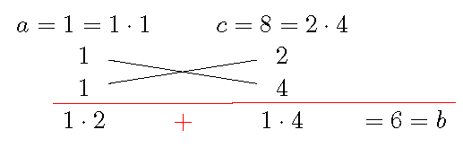
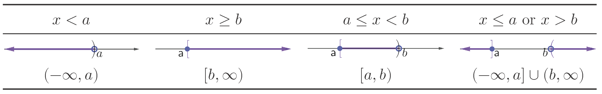
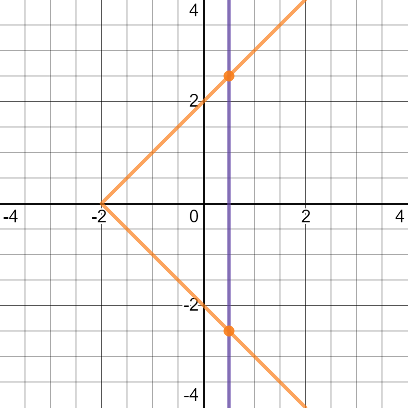
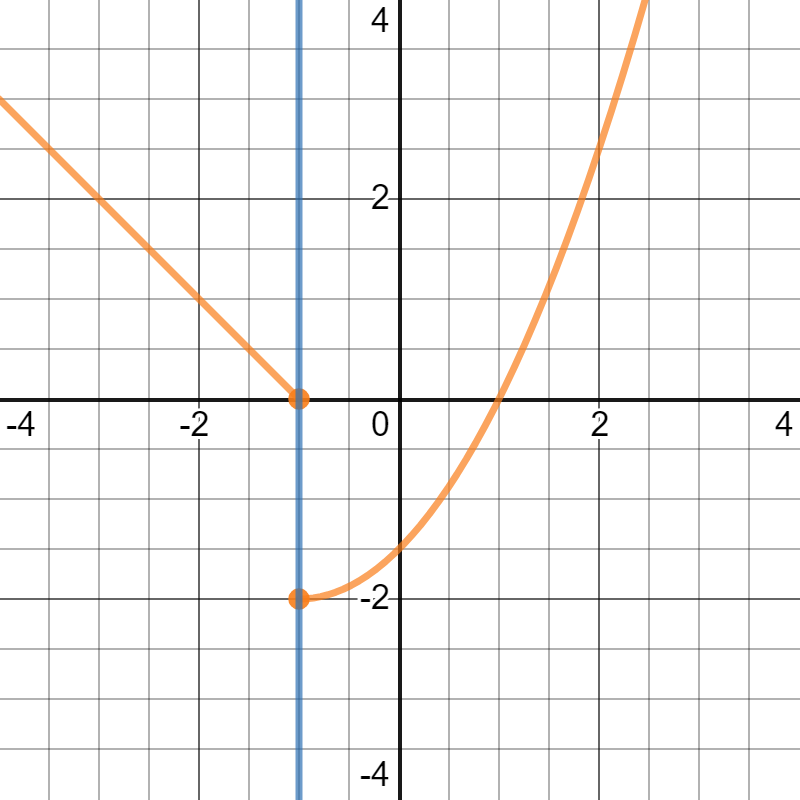
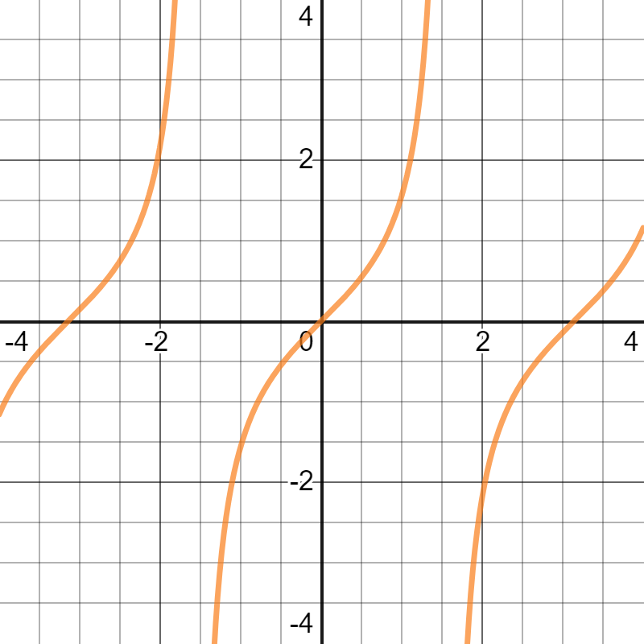
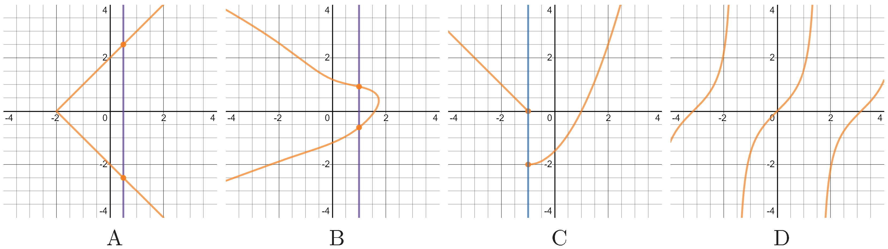
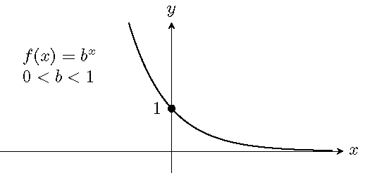

--- 
title: "Algebra and Geometry of Elementary Functions"
author: "Fei Ye"
date: "`r Sys.Date()`"
description: This notebook is designed to give a concise introduction to algebra and
  geometry of elementary functions which can be served as a textbook for a College
  Algebra course.
documentclass: elegantbook
github-repo: fyemath/agfun
logo: ''
cover: 'figs/algebrawordcloud.pdf'
site: bookdown::bookdown_site
classoption: en,11pt
version: '0.90'
---

<!-- ```{r remove_amsmath, include=FALSE} -->

<!-- options(bookdown.theorem.preamble = FALSE) -->

<!-- options(bookdown.post.latex = function(x) { -->
<!--   # Remove \iffalse \fi\\ -->
<!--   x<-gsub('^\\\\iffalse.\\\\fi\\{\\}+?(\\\\)', '', x) -->
<!-- }) -->
<!-- ``` -->

```{r fig_setting, include=FALSE}
library("knitr")
knitr::opts_chunk$set(out.width="60%", fig.align="center")
```

```{r child = 'redirect.R'}
```

\mainmatter

\hypersetup{pageanchor=true}

\renewcommand{\baselinestretch}{1.05}\normalsize

\captionsetup[figure]{labelformat=empty}
\captionsetup[subfigure]{labelformat=empty}

# Introduction {-}

This notebook is intended to give a brief introduction to elementary functions emphasizing on effective thinking in algebra and geometry.

In the first part, we will review mathematical operations including addition, multiplication, $n$-th root, exponentiation and logarithm.

In the second part, we will study the concepts of functions, algebraic functions and their applications.

In the third part, we will study elementary transcendental functions and applications.

Comments and suggestions are very welcome.

This work is licensed under a [Creative Commons Attribution-NonCommercial-ShareAlike 4.0 International License](https://creativecommons.org/licenses/by-nc-sa/4.0/).


<!--chapter:end:index.Rmd-->

# (PART\*) Part I: Mathematical Operations {-}

# Integer Exponents

## Don't Be Tricked

::: {.rmdthink}

1. A pizza shop sales 12-inches pizza and 8-inches pizza at the price \$12/each and \$6/each respectively.  With \$12, would you like to order one 12-inches and two 8-inches. Why?

2. A sheet of everyday copy paper is about 0.01 millimeter thick. Repeat folding along a different side 20 times. Now, how thick do you think the folded paper is?

:::

## Properties of Exponents

For an integer $n$, and an expression $x$, the mathematical operation of the $n$-times repeated multiplication of $x$  is call exponentiation, written as $x^n$, that is,
$$
x^n=\underbrace{x\cdot x \cdots x}_{n~\text{factors of}~x}.
$$

In the notation $x^n$, $n$ is called ***the exponent***, $x$ is called ***the base***, and $x^n$ is called ***the power***, read as "$x$ raised to the $n$-th power",  "$x$ to the $n$-th power", "$x$ to the $n$-th", "$x$ to the power of $n$" or "$x$ to the $n$".

| Property | Example|
|---|---|
|The product rule $$x^m\cdot x^n=x^{m+n}.$$ | $$2x^2\cdot (-3x^3)=-6x^5.$$ |
| The quotient rule (for $x\neq 0$.) $$\dfrac{x^m}{x^n}= \begin{cases} x^{m-n}  & \text{if} m\ge n.\\[1em] \dfrac{1}{x^{n-m}} & \text{if} m\le n. \end{cases} $$ | $$\frac{15x^5}{5x^2}=3x^3;$$ $$\frac{-3x^2}{6x^3}=-\frac{1}{2x}.$$ |
| The zero exponent rule (for $x\neq 0$.) $$x^0=1.$$ | $$(-2)^0=1;$$ $$-x^0=-1.$$ |
| The negative exponent rule (for $x\neq 0$.) $$x^{-n}=\dfrac{1}{x^n} \quad\text{and}\quad \dfrac{1}{x^{-n}}=x^n.$$ | $$(-2)^{-3}=\frac{1}{(-2)^3}=-\frac18;$$ $$\frac{x^{-2}}{x^{-3}}=\frac{x^3}{x^2}=x.$$ |
| The power to a power rule $$\left(x^a\right)^b=x^{ab}.$$ | $$\left(2^{2}\right)^3=2^6=64;$$ $$\left(x^2\right)^3=x^6.$$ |
| The product raised to a power rule $$(xy)^n=x^ny^n.$$ | $$\left(-2x\right)^{2}=(-2)^2x^2=4x^2.$$ |
| The quotient raised to a power rule (for $y\neq 0$.) $$\left(\dfrac{x}{y}\right)^n=\dfrac{x^n}{y^n}.$$ | $$    \left(\dfrac{x}{-2}\right)^{3}=\dfrac{x^3}{(-2)^3}=-\dfrac{x^3}{8}.$$ |

::: {.rmdnote}

**Order of Basic Mathematical Operations**  

In mathematics, the order of operations reflects conventions about which procedure should be performed first. There are four levels (from the highest to the lowest):

**Parenthesis**; **Exponentiation**; **Multiplication and Division**; **Addition and Subtraction**.  

Within the same level, the convention is to perform from the left to the right.

:::

:::{.example}

Simplify. **Write with positive exponents.**
$$
\left(\dfrac{2y^{-2}z^{-5}}{4x^{-3}y^6}\right)^{-4}.
$$

:::

:::{.solution}

The idea is to simplify the base first and rewrite using positive exponents only.

$$
\begin{aligned}
    \left(\dfrac{2y^{-2}z^{-5}}{4x^{-3}y^6}\right)^{-4}
=&\left(\dfrac{x^3}{2z^{5}y^8}\right)^{-4}\\
=&\left(\dfrac{2z^{5}y^8}{x^3}\right)^4\\
=&\dfrac{2^4(z^{5})^4(y^8)^4}{(x^3)^4}\\
=&\dfrac{16y^{32}z^{20}}{x^{12}}.\\
\end{aligned}
$$

:::

::: {.rmdtip}

**Simplify (at least partially) the problem first**  
To avoid mistakes when working with negative exponents, it's better to apply the negative exponent rule to change negative exponents to positive exponents and simplify the base first.

:::

\newpage

## Practice

:::{.exercise}

Simplify. **Write with positive exponents.**

1. $(3a^2b^3c^2)(4abc^2)(2b^2c^3)$
2. $\dfrac{4y^3z^0}{x^2y^2}$
3. $(-2)^{-3}$

:::

:::{.exercise}

Simplify. **Write with positive exponents.**

1. $\dfrac{-u^0v^{15}}{v^{16}}$
1. $(-2a^3b^2c^0)^3$
1. $\dfrac{m^5 n^{2}}{(mn)^3}$

:::

:::{.exercise}

Simplify. **Write with positive exponents.**

1. $(-3a^2x^3)^{-2}$
1. $\left(\dfrac{-x^0y^3}{2wz^2}\right)^3$
1. $\dfrac{3^{-2}a^{-3}b^5}{x^{-3}y^{-4}}$

:::

:::{.exercise}

Simplify. **Write with positive exponents.**

1. $\left(-x^{-1}(-y)^2\right)^3$
2. $\left(\dfrac{6x^{-2}y^5}{2y^{-3}z^{-11}}\right)^{-3}$
3. $\dfrac{(3 x^{2} y^{-1})^{-3}(2 x^{-3} y^{2})^{-1}}{(x^{6} y^{-5})^{-2}}$

:::

:::{.exercise}

A store has large size and small size watermelons. A large one cost \$4 and a small one \$1. Putting on the same table, a smaller watermelons has only half the height of the larger one. Given \$4, will you buy a large watermelon or 4 smaller ones? Why?

:::

<!--chapter:end:101-Integer-Exponents.Rmd-->

---
output:
  pdf_document: default
  html_document: default
---
# Review of Factoring

## Can You Beat a Calculator

::: {.rmdthink}

Do you know a faster way to find the values?

1. Find the value of the polynomial $2x^3-98x$ when $x=-7$.
2. Find the value of the polynomial $x^2-9x-22$ when $x=11$.
3. Find the value of the polynomial $x^3-2x^2-9x+18$ when $x=-3$.
4. Find the value of $16^2-14^2$.

:::

## Factor by Removing the GCF

***The  greatest common factor (GCF)*** of two terms is a polynomial with the **greatest coefficient** and of the **highest possible degree** that divides each term.

To ***factor a polynomial*** is to **express the polynomial as a product** of polynomials of lower degrees. The first and the easiest step is to factor out the GCF of all terms.

:::{.example}  

Factor $4x^3y-8x^2y^2+12x^3y^3$.

:::

:::{.solution}  
\  

1. Find the GCF of all terms.\
   The GCF of $4x^3y$, $-8x^2y^2$ and $12x^4y^3$ is $4x^2y$.
2. Write each term as the product of the GCF and the remaining factor.\
   $4x^3y=(4x^2y)\cdot x$, $-8x^2y^2=(4x^2y)\cdot (-2y)$, and $12x^4y^3=(4x^2y)(3xy^2)$.
3. Factor out the GCF from each term.\
   $4x^3y-8x^2y^2+12x^3y^3=4x^2y\cdot(x-2y+3xy^2)$.

:::

## Factor by Grouping

For a four-term polynomial, in general, we will group them into two groups and factor out the GCF for each group and then factor further.

:::{.example}

Factor $2x^2-6xy+xz-3yz$.

:::

:::{.solution}  
\  

For a polynomial with four terms, one can normally try the grouping method.

1. Group the first two terms and the last two terms.
   $$
    \begin{aligned}
    &2x^2-6xy+xz-3yz\\
    =&(2x^2-6xy)+(xz-3yz)
    \end{aligned}
   $$
2. Factor out the GCF from each group.  
   $$
    \begin{aligned}
    =&2x(x-3y)+z(x-3y)
    \end{aligned}
   $$
3. Factor out the binomial GCF.
   $$
    \begin{aligned}
    =&(x-3y)(2x+z).
    \end{aligned}
   $$

:::

:::{.example}

Factor $ax+4b-2a-2bx$.

:::

:::{.solution}  
\
  
1. Group the first term with the third term and group the second term with the last term.
    $$
    \begin{aligned}
    &ax+4b-2a-2bx\\
    =&(ax-2a)+(-2bx+4b)
    \end{aligned}
    $$
2. Factor out the GCF from each group.
    $$
    \begin{aligned}
    =&a(x-2)+(-2b)(x-2)
    \end{aligned}
    $$
3. Factor out the binomial GCF.
    $$
    \begin{aligned}
    =&(x-2)(a-2b).
    \end{aligned}
    $$

:::

::: {.rmdtip}

**Guess and check.**  

Once you factored one group, you may expect that the other group has the same binomial factor so that factoring may be continued.

:::

## Factor Difference of Powers

Factoring is closely related to solving polynomial equations. If a polynomial equation $p(x)=0$ has a solution $r$, then $p(x)$ has a factor $x-r$. For example, $x^n-r^n=0$ has a solution $x=r$. So the difference $x^n-r^n$ has a factor $(x-r)$. Using long division or by induction, we obtain the following equality.

**Difference of $n$-th powers**

$$a^n-b^n=(a-b)(a^{n-1}+a^{n-2}b+\cdots +ab^{n-2}+b^{n-1})$$

In particular,

$$a^2-b^2=(a-b)(a+b).$$

:::{.example}

Factor $25x^2-16$.

:::

:::{.solution}
\

1. Recognize the binomial as a difference of squares.
$$\begin{aligned}
&25x^2-16\\
=&(5x)^2-4^2
\end{aligned}
$$
2. Apply the formula.
$$
\begin{aligned}
=&(5x-4)(5x+4).
\end{aligned}
$$

:::

:::{.example}

Factor $32x^3y-2xy^5$ completely.

:::

:::{.solution}
\

$$
\begin{aligned}
    32x^3y-2xy^3
    =&2xy(16x^2-y^4)\\
    =&2xy((4x)^2-(y^2)^2)\\
    =&2xy(4x+y^2)(4x-y^2).
\end{aligned}
$$

:::

## Factor Trinomials

If a trinomial $ax^2+bx+c$, $A\neq 0$, can be factored, then it can be expressed as a product of two binomials:  
$$ax^2+bx+c=(mx+n)(px+q).$$
By simplify the product using the FOIL method and comparing coefficients, we observe that  
$$
a=\underbrace{mn}_{\mathrm{F}}\quad\quad\quad
b=\underbrace{mq}_{\mathrm{O}}~\underset{+}{\underset{}{+}}~\underbrace{np}_{\mathrm{I}}
\quad\quad\quad
c=\underbrace{nq}_{\mathrm{F}}
$$

A trinomial $ax^2+bx+c$ is also called a ***quadratic polynomial***. The function defined by $f(x)=ax^2+bx+c$ is called a ***quadratic function***.

::: {.rmdtip}

**Trial and error.**  

The observation suggests to use trial and error to find the undetermined coefficients $m$, $n$, $p$, and $q$ from factors of $a$ and $c$ such that the sum of cross products $mq+np$ is $b$. A diagram as shown in the following examples will be helpful to check a trial.

:::

:::{.example}

Factor $x^2+6x+8$.

:::

:::{.solution}

One may factor the trinomial in the following way.

1. Factor $a=1$:
   $$1=1\cdot 1.$$

2. Factor $c=8$:
   $$8=1\cdot 8=2\cdot 4.$$

3. Choose a proper combination of pairs of factors and check if the sum of cross product equals $b=6$:
   $$1\cdot 4+ 1\cdot 2=6.$$  
   This step can be checked easily using the following diagram.

   {.center}

4. Factor the trinomial
    $$x^2+6x+8=(x+2)(x+4).$$

:::

:::{.example}

Factor $2x^2+5x-3$.

:::

:::{.solution}

One may factor the trinomial in the following way.

1. Factor $a=2$:
   $$1=1\cdot 2.$$

2. Factor $c=-3$:
   $$-3=1\cdot (-3)=(-1)\cdot 3.$$

3. Choose a proper combination of pairs of factors and if the sum of cross products equals $b=5$:  
   $$2\cdot 3+1\cdot(-1)=5.$$  
   This step can be checked easily using the following diagram.

   {.center}

4. Factor the trinomial
   $$2x^2+5x-3=(x+3)(2x-1).$$

:::

::: {.rmdtip}

**Use Auxiliary Problem.**  

Some higher degree polynomials may be rewrite as a trinomial after a  substitution. Factoring the trinomial helps factor the polynomial.

:::

:::{.example}

Factor the trinomial completely.

$$4x^4-x^2-3$$

:::

:::{.solution}

One idea is to use a substitute.

1. Let $x^2=y$. Then $4x^4-x^2-3=4y^2-y-3$.
2. Factor the trinomial in $y$:   $4y^2-y-3=(4y+3)(y-1)$.
3. Replace $y$ by $x^2$ and factor further.
$$
    \begin{split}
        4x^4-x^2-3&=4y^2-y-3\\
        &=(4y+3)(y-1)\\
        &=(4x^2+3)(x^2-1)\\
        &=(4x^2+3)(x-1)(x+1).
    \end{split}
$$

:::

\newpage

## Practice

:::{.exercise}

Factor out the GCF.

1. $18x^2y^2-12xy^3-6x^3y^4$
1. $5x(x-7)+3y(x-7)$
1. $-2a^2(x+y)+3a(x+y)$

:::

:::{.exercise}

Factor by grouping.

1. $12xy-10y+18x-15$
1. $12ac-18bc-10ad+15bd$
1. $5ax-4bx-5ay+4by$

:::

:::{.exercise}

Factor completely.

1. $25x^2-4$
1. $8x^3-2x$
1. $25xy^2+x$

:::

:::{.exercise}

Factor completely.

1. $3x^3+6x^2-12x-24$
1. $x^4+3x^3-4x^2-12x$

:::

:::{.exercise}

Factor the trinomial.

1. $x^2+4x+3$
2. $x^2+6x-7$
3. $x^2-3x-10$

:::

:::{.exercise}  

Factor the trinomial.

1. $5x^2+7x+2$
2. $2x^2+5x-12$
3. $3x^2-10x-8$

:::

:::{.exercise}  

Factor completely into polynomials with integer coefficients.

1. $x^3-5x^2+6x$
2. $4x^4-12x^2+5$
3. $2x^3y-9x^2y^2-5xy^3$

:::

:::{.exercise}

Each of trinomial below has a factor in the table. Match the letter on the left of a factor with a the number on the left a trinomial to decipher the following quotation.

"$\dfrac{\phantom{A}}{13}$\quad $\dfrac{\phantom{A}}{10~~2~~9~~15}$,\quad $\dfrac{\phantom{A}}{9~~5~~14}$\quad $\dfrac{\phantom{A}}{13}$\quad $\dfrac{\phantom{A}}{4~~3~~15~~7~~2~~1}$;
\phantom{"} $\dfrac{\phantom{A}}{13}$\quad $\dfrac{\phantom{A}}{11~~2~~2}$,\quad $\dfrac{\phantom{A}}{9~~5~~14}$\quad $\dfrac{\phantom{A}}{13}$\quad $\dfrac{\phantom{A}}{8~~5~~3~~6}$;
\phantom{"} $\dfrac{\phantom{A}}{13}$\quad $\dfrac{\phantom{A}}{14~~3}$,\quad $\dfrac{\phantom{A}}{9~~5~~14}$\quad $\dfrac{\phantom{A}}{13}$\quad $\dfrac{\phantom{A}}{12~~5~~14~~2~~15~~11~~1~~9~~5~~14}$."

||||||||
|---|---|---|---|---|---|---|
| **A:** $3x-2$ | **B:** $2x+1$ | **C:** $x+6$ | **D:** $x+7$ | **E:** $2x-1$ | **F:** $3x-1$ | **G:** $x+10$ |
| **H:** $x-8$ | **I:** $2x+9$ | **J:** $x-1$ | **K:** $x+3$ | **L:** $2x-5$ | **M:** $x+5$ | **N:** $x-7$ |
| **O:** $x-13$ | **P:** $5x-3$ | **Q:** $4x-11$ | **R:** $x-9$ | **S:** $2x+3$ | **T:** $x+4$ | **U:** $7x+1$ |
| **V:** $3x+5$ | **W:** $3x+4$ | **X:** $8x+3$ | **Y:** $x-14$ | **Z:** $5x-6$ | | |

:::

::: {.threecols .riddle}

1. $x^2-2x-24$
1. $6x^2+x-2$
1. $x^2-16x+39$
1. $6x^2+13x-5$
1. $x^2-5x-14$  \columnbreak
1. $3x^2-5x-12$
1. $x^2-x-110$
1. $x^2-9$
1. $-3x^2+11x-6$
1. $x^2-10x+16$  \columnbreak
1. $-2x^2+5x+12$
1. $42x^2-x-1$
1. $-2x^2-3x+27$
1. $x^2+14x+49$
1. $x^2-81$

:::

<!--chapter:end:102-Factoring.Rmd-->

# Algebra of Rational Expressions

## Is There Enough Time

::: {.rmdthink}

1. Matt is kayaking upstream on a river with his best effort. After 30 minutes, he received an emergency call and has to return in 20 minute. The speed of the current of the river is 1 mph.  Under normal condition, a paddler's average paddling speed is between 2 and 5 mph. Do you think Matt can return on time? Why?

2. A construction team is building a house. After half of the work was done, to expedite the construction process, the another team joins in the construction. The first team normally takes 7-10 days to build a hours. The second team normally takes 2 extra days to build a house. How many days it takes to build the house?

:::

## Rational Expressions

Let $P$ and $Q$ be polynomials. Suppose that $Q$ is not a constant function. The quotient $\frac{P}{Q}$ is called a ***rational expression***, the polynomial $P$ is called the ***numerator***, and the polynomial $Q$ is called the ***denominator***.

A rational expression is ***simplified*** if the numerator and the denominator have no common factor other than $1$.

Let $P$, $Q$ be polynomials with $Q\neq 0$ and $C$ be a nonzero expression. Then
$$
\dfrac{~P\cdot C~}{~Q\cdot C~}=\dfrac{~P~}{~Q~}.
$$

:::{.example}

Simplify $\dfrac{x^2+4x+3}{x^2+3x+2}$.

:::

:::{.solution}
\

1. Factor both the top and the bottom.
$$
    \dfrac{x^2+4x+3}{x^2+3x+2}=\dfrac{(x+1)(x+3)}{(x+1)(x+2)}.
$$

1. Divide out common factors.
$$
    \dfrac{(x+1)(x+3)}{(x+1)(x+2)}=\dfrac{x+3}{x+2}.
$$

:::

:::{.example}

Simplify $\dfrac{2x^2-x-3}{2x^2-3x-5}$.

:::

:::{.solution}
\

1. Factor both the top and the bottom.
$$\dfrac{2x^2-x-3}{2x^2-3x-5}=\dfrac{(x+1)(2x-3)}{(x+1)(2x-5)}.$$

1. Divide out common factors.
$$\dfrac{(x+1)(2x-3)}{(x+1)(2x-5)}=\dfrac{2x-3}{2x-5}.$$

:::

## Multiplying Rational Expressions

If $P$, $Q$, $S$, $T$ are polynomials with $Q\neq 0$ and $T\neq 0$, then
$$
\dfrac{~P~}{~Q~}\cdot\dfrac{~S~}{~T~}=\dfrac{~P\cdot S~}{~Q\cdot T~}.
$$

:::{.example}

Multiply and then simplify.
$$\dfrac{3x^2}{x^2+x-6}\cdot\dfrac{x^2-4}{6x}.$$

:::

:::{.solution}
\

1. Factor numerators and denominators.
$$
    \dfrac{3x^2}{x^2+x-6}\cdot\dfrac{x^2-4}{6x}=\dfrac{3\cdot x\cdot x}{(x-2)(x+3)}\cdot\dfrac{(x-2)(x+2)}{2\cdot3\cdot x}
$$

1. Multiply and simplify.
$$
    \dfrac{\cancel{3}\cdot \cancel{x}\cdot x\cdot\cancel{(x-2)}(x+2)}{\cancel{(x-2)}(x+3)\cdot 2\cdot\cancel{3}\cdot \cancel{x}}=\dfrac{x(x+2)}{2(x+3)}
$$

:::

:::{.example}

Multiply and then simplify.
$$
\dfrac{3x^2-8x-3}{x^2+8x+16}\cdot\dfrac{x^2-16}{5x^2-14x-3}.
$$

:::

:::{.solution}
\

$$
\dfrac{3x^2-8x-3}{x^2+8x+16}\cdot\dfrac{x^2-16}{5x^2-14x-3}
=\dfrac{(3x+1)\cancel{(x-3)}\cancel{(x+4)}(x-4)}{\cancel{(x+4)}(x+4)(5x+1)\cancel{(x-3)}}
=\dfrac{(3x+1)(x-4)}{(x+4)(5x+1)}
$$

:::

## Dividing Rational Expressions

If $P$, $Q$, $S$, $T$ are polynomials with $Q\neq 0$ and $T\neq 0$, then
$$
\dfrac{~P~}{~Q~}\div\dfrac{~S~}{~T~}=\dfrac{~P~}{~Q~}\cdot\dfrac{~T~}{~S~}=\dfrac{~P\cdot T~}{~Q\cdot S~}.
$$

:::{.example}

Divide and then simplify.  
$$
\dfrac{2x+6}{x^2-6x-7}\div \dfrac{6x-2}{2x^2-x-3}.
$$

:::

:::{.solution}
\

1. Rewrite as a multiplication.  
$$
\dfrac{2x+6}{x^2-6x-7}\div \dfrac{6x-2}{2x^2-x-3}=\dfrac{2x+6}{x^2-6x-7}\cdot\dfrac{2x^2-x-3}{6x-2}
$$
1. Factor and simplify.  
$$
\dfrac{2x+6}{x^2-6x-7}\cdot\dfrac{2x^2-x-3}{6x-2}
=\dfrac{\cancel{2}(x+3)\cancel{(x+1)}(2x-3)}{\cancel{2}\cancel{(x+1)}(x-7)(3x-1)}
=\dfrac{(x+3)(2x-3)}{(x-7)(3x-1)}
$$

:::

## Adding or Subtracting Rational Expressions with the Same Denominator

If $P$, $Q$ and $R$ are polynomials with $R\neq 0$, then
$$
\dfrac{~P~}{~R~}+\dfrac{~Q~}{~R~}=\dfrac{~P+Q~}{~R~}\qquad \text{and} \qquad
\dfrac{~P~}{~R~}-\dfrac{~Q~}{~R~}=\dfrac{~P-Q~}{~R~}.
$$

:::{.example}

Add and simplify  
$$
\dfrac{x^2+4}{x^2+3x+2}+\dfrac{5x}{x^2+3x+2}.
$$

:::

:::{.solution}
\

1. Determine if the rational expressions have the same denominator. If so, the new numerator will be the sum/difference of the numerators.
$$
    \dfrac{x^2+4}{x^2+3x+2}+\dfrac{5x}{x^2+3x+2}=\dfrac{x^2+5x+4}{x^2+3x+2}.
$$
1. Simplify the resulting rational expression.
$$
    \dfrac{x^2+5x+4}{x^2+3x+2}=\dfrac{(x+1)(x+4)}{(x+1)(x+2)}=\dfrac{x+4}{x+2}.
$$

:::

:::{.example}

Subtract and simplify $\dfrac{2x^2}{2x^2-x-3}-\dfrac{3x+5}{2x^2-x-3}$.

:::

:::{.solution}
\

$$
\begin{aligned}
    \dfrac{2x^2}{2x^2-x-3}-\dfrac{3x+5}{2x^2-x-3}=&\dfrac{2x^2-3x-5}{2x^2-x-3}\\
    =&\dfrac{(2x-5)(x+1)}{(2x-3)(x+1)}\\
    =&\dfrac{2x-5}{2x-3}.
\end{aligned}
$$

:::

## Adding or Subtracting Rational Expressions with Different Denominators

To add or subtract rational expressions with different denominators, we need to rewrite the rational expressions to equivalent rational expressions with the same denominator, say the LCD.

::: {.rmdtip}

**Equivalent Reduction.**  
What if all denominators are the same? How to make denominators the same?

A general strategy to solve such a problem is to reduce the problem to an easier one using equivalent operations.

:::

:::{.example}

Find the LCD of $\dfrac{3}{x^2-x-6}$ and $\dfrac{6}{x^2-4}$.

:::

:::{.solution}
\

1. Factor each denominator.
$$
    x^2-x-6=(x+2)(x-3)\qquad x^2-4=(x-2)(x+2)
$$
1. List the factors of the first denominator and add unlisted factors of the second factor to get the final list.

    ||||
    |:---|:---:|:---:|:---:|
    |First list  | $(x+2)$ | $(x-3)$ |         |
    |Second list | $(x+2)$ |         | $(x-2)$ |
    |Final list  | $(x+2)$ | $(x-3)$ | $(x-2)$ |

1. The LCD is the product of factors in the final list.  
$$(x+2)(x-3)(x-2).$$

:::

:::{.example}

Subtract and simplify  
$$\dfrac{x-3}{x^2-2x-8}- \dfrac{1}{x^2-4}$$

:::

:::{.solution}
\

1. Find the LCD.  
    1. First factor denominators.  
        $$x^2-2x-8=(x+2)(x-4)$$
        $$x^2-4=(x-2)(x+2)$$
    2. Then using the table to find the final list of factors of the LCD.

        ||||
        |:---|:---:|:---:|:---:|
        |First list| $(x+2)$ |         | $(x-4)$ |
        |Second list | $(x+2)$ | $(x-2)$ |         |
        | Final list  | $(x+2)$ | $(x-2)$ | $(x-4)$ |

    The LCD is $(x+2)(x-2)(x-4)$.
2. Rewrite each rational expression into an equivalent expression with the LCD as the new denominator.  
    $$
        \dfrac{x-3}{x^2-2x-8}- \dfrac{1}{x^2-4}=\dfrac{(x-3)(x-2)}{(x+2)(x-2)(x-4)}-\dfrac{(x-4)}{(x+2)(x-2)(x-4)}
    $$
1. Subtract and simplify.  
    $$
        \dfrac{(x-3)(x-2)-(x-4)}{(x+2)(x-2)(x-4)}=\dfrac{(x^2-5x+6)-(x-4)}{(x+2)(x-2)(x-4)}=\dfrac{x^2-6x+10}{(x+2)(x-2)(x-4)}
    $$

:::

## Simplifying Complex Rational Expressions

A ***complex rational expression*** is a rational expression whose denominator or numerator contains a rational expression.

A complex rational expression is equivalent to the quotient of its numerator by its denominator. That suggests the following strategy to simplify a complex rational expression.

::: {.rmdtip}

**Simplify and Change the Viewpoint.** A complex rational expression is a quotient of two rational expressions. You may rewrite it as an multiplication by flipping the denominator. However, it's better to simply the numerator and denominator or you won't see a good looking new expression.

:::

:::{.example}

Simplify
$$
\dfrac{~\dfrac{2x-1}{x^2-1}+\dfrac{x-1}{x+1}~}{~\dfrac{x+1}{x-1}-\dfrac{1}{x^2-1}~}
$$

:::

:::{.solution}
\

1. Simplify the numerator and the denominator.
    $$
        \begin{aligned}
            \dfrac{~\dfrac{2x-1}{x^2-1}+\dfrac{x-1}{x+1}~}{~\dfrac{x+1}{x-1}-\dfrac{1}{x^2-1}~}
            =&\dfrac{
                ~\dfrac{2x-1}{(x-1)(x+1)}+\dfrac{(x-1)(x-1)}{(x-1)(x+1)}~
            }{~
                \dfrac{(x+1)(x+1)}{(x-1)(x+1)}-\dfrac{1}{(x-1)(x+1)}~
            }\\[5pt]
            =&\dfrac{
                ~\dfrac{(2x-1)+(x-1)(x-1)}{(x-1)(x+1)}~
            }{
                ~\dfrac{(x+1)(x+1)-1}{(x-1)(x+1)}~
            }\\[5pt]
            =&\dfrac{
                ~\dfrac{(2x-1)+(x^2-2x+1)}{(x-1)(x+1)}~
            }{
                ~\dfrac{(x^2+2x+1)-1}{(x-1)(x+1)}~
            }\\[5pt]
            =&\dfrac{
                ~\dfrac{x^2}{(x-1)(x+1)}~
            }{
                ~\dfrac{x^2+2x}{(x-1)(x+1)}~
            }
        \end{aligned}
    $$
1. Rewrite as a product.
    $$
        \dfrac{
            ~\dfrac{x^2}{(x-1)(x+1)}~
        }{
            ~\dfrac{x^2+2x}{(x-1)(x+1)}~
        }
        =\dfrac{x^2}{(x-1)(x+1)}\cdot \dfrac{(x-1)(x+1)}{x^2+2x}
    $$
1. Multiply and simplify.
    $$
        \begin{aligned}
        \dfrac{x^2}{(x-1)(x+1)}\cdot \dfrac{(x-1)(x+1)}{x^2+2x}
        =&\dfrac{x\cdot x}{(x-1)(x+1)}\cdot \dfrac{(x-1)(x+1)}{x(x+2)}\\[5pt]
        =& \dfrac{\bcancel{x}x\cancel{(x-1)(x+1)}}{\bcancel{x}(x+2)\cancel{(x-1)(x+1)}}\\[5pt]
        =& \dfrac{x}{x+2}
        \end{aligned}
    $$

:::

::: {.rmdnote}

Another way to simplify a complex rational expression is to multiply the LCD to both the denominator and numerator and then simplify.

:::

:::{.example}

Simplify
$$\dfrac{~\dfrac{x+1}{x-1}+\dfrac{x-1}{x+1}~}{~\dfrac{x+1}{x-1}-\dfrac{x-1}{x+1}~}$$

:::

:::{.solution}
\

1. Find the LCD of all denominators.  
    In this case, the LCD is $(x-1)(x+1)$.
2. Multiply the complex rational expression by $\dfrac{(x-1)(x+1)}{(x-1)(x+1)}$ and simplify.
$$
\begin{aligned}
    \dfrac{~\dfrac{x+1}{x-1}+\dfrac{x-1}{x+1}~}{~\dfrac{x+1}{x-1}-\dfrac{x-1}{x+1}~}
    =&\dfrac{~\dfrac{x+1}{x-1}+\dfrac{x-1}{x+1}~}{~\dfrac{x+1}{x-1}-\dfrac{x-1}{x+1}~}\cdot \dfrac{(x-1)(x+1)}{(x-1)(x+1)}\\[5pt]
    =& \dfrac{~(x-1)(x+1)\left(\dfrac{x+1}{x-1}+\dfrac{x-1}{x+1}\right)~}{~(x-1)(x+1)\left(\dfrac{x+1}{x-1}-\dfrac{x-1}{x+1}\right)~}\\[5pt]
    =& \dfrac{~(x+1)^2+(x-1)^2~}{~(x+1)^2-(x-1)^2~}\\[5pt]
    =& \dfrac{x^2+1}{2x}
\end{aligned}
$$

:::

\newpage

## Practice

:::{.exercise}

Simplify.  

1. $\dfrac{3x^2-x-4}{x+1}$

2. $\dfrac{2x^2-x-3}{2x^2+3x+1}$

3. $\dfrac{x^2-9}{3x^2-8x-3}$

:::

:::{.exercise}

Multiply and simplify.  

1. $\dfrac{x+5}{x+4}\cdot\dfrac{x^2+3x-4}{x^2-25}$

1. $\dfrac{3x^2-2x}{x+2}\cdot\dfrac{3x^2-4x-4}{9x^2-4}$

1. $\dfrac{6y-2}{3-y}\cdot\dfrac{y^2-6y+9}{3y^2-y}$

:::

:::{.exercise}

Divide and simplify.  

1. $\dfrac{9x^2-49}{6}\div\dfrac{3x^2-x-14}{2x+4}$

2. $\dfrac{x^2+3x-10}{2x-2}\div\dfrac{x^2-5x+6}{x^2-4x+3}$

3. $\dfrac{y-x}{xy}\div\dfrac{x^2-y^2}{y^2}$

:::

:::{.exercise}

Simplify.
$$
\frac{-x^2+11x-18}{x^2-4x+4}\div \frac{x^2-5x-36}{x^2-7x+12}\cdot \frac{2x^2+7x-4}{x^2+2x-15}
$$

:::

:::{.exercise}

Add/subtract and simplify.

1. $\dfrac{x^2+2x-2}{x^2+2x-15}+\dfrac{5x+12}{x^2+2x-15}$
1. $\dfrac{3x-10}{x^2-25}-\dfrac{2x-15}{x^2-25}$
1. $\dfrac{4}{(x-3)(x+2)}+\dfrac{3x-2}{x^2-x-6}$

:::

:::{.exercise}

Find the LCD of rational expressions.

1. $\dfrac{2x}{2x^2-5x-3}$\quad and \quad $\dfrac{x-1}{x^2-x-6}$
1. $\dfrac{9}{7x^2-28x}$ \quad and \quad $\dfrac{2}{x^2-8x+16}$

:::

:::{.exercise}

Add and simplify.

1. $\dfrac{x}{x+1}+\dfrac{x-1}{x+2}$
1. $\dfrac{x+2}{2x^2-x-3}+\dfrac{1}{x^2+3x+2}$
1. $\dfrac{4}{x-3}+\dfrac{3x-2}{x^2-x-6}$

:::

:::{.exercise}

Subtract and simplify.

1. $\dfrac{3x+5}{x^2-7x+12}-\dfrac{3}{x-3}$
1. $\dfrac{y}{y^2-5y-6}-\dfrac{7}{y^2-4y-5}$
1. $\dfrac{2x-3}{x^2+3x-10}-\dfrac{x+2}{x^2+2x-8}$

:::

:::{.exercise}

Simplify.
$$
\frac{x+11}{7x^2-2x-5}+\frac{x-2}{x-1}-\frac{x}{7x+5}
$$

:::

:::{.exercise}

Subtract and simplify.
$$
\frac{x-1}{x^2-3x}+\frac{4}{x^2-2\:x-3}-\frac{1}{x\left(x+1\right)}
$$

:::

:::{.exercise}

Simplify.

1. $\dfrac{~1+\dfrac{2}{x}~}{~1-\dfrac{2}{x}~}$
1. $\dfrac{~\dfrac{1}{x^2}-1~}{~\dfrac{1}{x^2}-\dfrac{1}{x}~}$

:::

:::{.exercise}

Simplify.

1. $\dfrac{~\dfrac{x^2-y^2}{y^2}~}{~\dfrac1x-\dfrac{1}{y}~}$
1. $\dfrac{~\dfrac{2}{(x+1)^2}-\dfrac{1}{x+1}~}{~1-\dfrac{4}{(x+1)^2}~}$

:::

:::{.exercise}

Simplify.

1. $\dfrac{~\dfrac{5x}{x^2-x-6}~}{~\dfrac2{x+2}+\dfrac{3}{x-3}~}$
2. $\dfrac{~\dfrac{x+1}{x-1}+\dfrac{x-1}{x+1}~}{~\dfrac{x+1}{x-1}-\dfrac{x-1}{x+1}~}$


:::

:::{.exercise}

Tim and Jim refill their cars at the same gas station twice last month. Each time Tim got \$20 gas and Jim got 8 gallon. Suppose they refill their cars on same days. The price was \$2.5 per gallon the first time. The price on the second time changed. Can you find out who had the better average price?

:::

<!--chapter:end:103-Rational-Expressions.Rmd-->

# Radicals and Rational Exponents

## Do You Want to Be a Fire Fighter

::: {.rmdthink}

To reach the 5th floor window of a building that is 25 feet from the location of the turntable aerial ladder truck. How long should the ladder be placed to reach the window? The hight of that window is 50 feet.

```{r echo=FALSE, out.width="80%", fig.align="center"}

knitr::include_graphics("figs/Aerial-Apparatus-Positioning.png")

```

:::

## Radical Expressions

If $b^2=a$, then we say that $b$ is a ***square root*** of $a$. We denote the positive square root of $a$ as $\sqrt{a}$, called the ***principal square root***.

For any real number $a$, the expression $\sqrt{a^2}$ can be simplified as
$$
\sqrt{a^2}=|a|.
$$

If $b^3=a$, then we say that $b$ is a ***cube root*** of $a$. The cube root of a real number $a$ is denoted by $\sqrt[3]{a}$.

For any real number $a$, the expression $\sqrt[3]{a^3}$ can be simplified as
$$
\sqrt[3]{a^3}=a.
$$

In general, if $b^n=a$, then we say that $b$ is an ***$n$-th root*** of $a$. If $n$ is **even**, the **positive** $n$-th root of $a$, called the ***principal $n$-th root***, is denoted by $\sqrt[n]{a}$. If $n$ is odd,  the $n$-the root $\sqrt[n]{a}$ of $a$ has the same sign with $a$.

In $\sqrt[n]{a}$, the symbol $\sqrt{\phantom{a}}$ is called the ***radical sign***, $a$ is called  the ***radicand***, and $n$ is called the ***index***.

If $n$ is even, then the $n$-th root of a negative number is not a real number.

For any real number $a$, the expression $\sqrt[n]{a^n}$ can be simplified as

1. $\sqrt[n]{a^n}=|a|$ if $n$ is even.
1. $\sqrt[n]{a^n}=a$ if $n$ is odd.

A radical is simplified if the radicand has no perfect power factors against the radical.

:::{.example}

Simplify the radical expression using the definition.

1. $\sqrt{4(y-1)^2}$
1. $\sqrt[3]{-8x^3y^6}$

:::

:::{.solution}
\

1. $\sqrt{4(y-1)^2}=\sqrt{[2(y-1)]^2}=2|y-1|$.
2. $\sqrt[3]{-8x^3y^6}=\sqrt[3]{(-2xy^2)^2}=-2xy^2$.

:::

## Rational Exponents

If $\sqrt[n]{a}$ is a real number, then we define $a^{\frac mn}$ as
$$
a^{\frac mn}=\sqrt[n]{a^m}=(\sqrt[n]{a})^m.
$$

Rational exponents have the same properties as integral exponents:

<p class="enuminline">
1. $a^m\cdot a^n=a^{m+n}$
2. 1. $\dfrac{a^m}{a^n}=a^{m-n}$
3. $a^{-\frac mn}=\dfrac{~1~}{~a^{\frac mn}~}$
   \
4. $(a^m)^n=a^{mn}$
5. $(ab)^m=a^m\cdot b^m$
6. $\left(\dfrac ab\right)^m=\dfrac{a^m}{b^m}$
\
</p>

:::{.example}

Simplify the radical expression or the expression with rational exponents. **Write in radical notation**.

1. $\sqrt{x}\sqrt[3]{x^2}$
2. $\sqrt[3]{\sqrt{x^3}}$
3. $\left(\frac{x^{\frac12}}{x^{-\frac56}}\right )^{\frac14}$
4. $\sqrt{\frac{x^{-\frac12}y^2}{x^{\frac32}}}$

:::

:::{.solution}
\

1. 
$$\sqrt{x}\sqrt[3]{x^2}=x^{\frac12}x^{\frac{2}{3}}=x^{\frac{1}{2}+\frac{2}{3}}=x^\frac{7}{6}=x\sqrt[6]{x}.$$
2.
$$
\sqrt[3]{\sqrt{x^3}}=(\sqrt{x^3})^\frac{1}{3}=[(x^3)^{\frac{1}{2}}]^{\frac{1}{3}}=x^{3\cdot\frac{1}{2}\cdot\frac{1}{3}}=x^{\frac{1}{2}}=\sqrt{x}.
$$
3.
$$
\left(\frac{x^{\frac12}}{x^{-\frac56}}\right)^{\frac14}=(x^{\frac12}x^{\frac56})^{\frac14}=(x^{\frac{1}{2}+\frac{5}{6}})^{\frac{1}{4}}=(x^\frac{4}{3})^{\frac{1}{4}}=x^{\frac{1}{3}}=\sqrt[3]{x}.
$$
4.
$$
\sqrt{\frac{x^{-\frac12}y^2}{x^{\frac32}}}=\sqrt{\frac{y^2}{x^2}}=\sqrt{\left(\frac yx\right)^2}=\left|\frac yx\right|.
$$

:::

::: {.rmdnote}

In general, rewriting radical in rational exponents helps simplify calculations.

:::

## Product and Quotient Rules for Radicals

If $\sqrt[n]{a}$ and $\sqrt[n]{b}$ are real numbers, then
$${\sqrt[n]a}{\sqrt[n]b}=\sqrt[n]{ab}.$$

If $\sqrt[n]a$ and $\sqrt[n]b$ are real numbers and $b\neq 0$, then
$$\dfrac{\sqrt[n]a}{\sqrt[n]b}=\sqrt[n]{\dfrac ab}.$$

:::{.example}

Simplify the expression.

1. $\sqrt[4]{8xy^4}\sqrt[4]{2x^7y}$.
1. $\dfrac{\sqrt[5]{96x^9y^3}}{\sqrt[5]{3x^{-1}y}}$.

:::

:::{.solution}
\

1. $\sqrt[4]{8xy^4}\sqrt[4]{2x^7y}=\sqrt[4]{(8xy^4)\cdot (2x^7y)}=\sqrt[4]{16x^8y^5}=\sqrt[4]{2^4(x^2)^4y^4\cdot y}=2x^2y\sqrt[4]{y}$.
2. $\dfrac{ \sqrt[5]{96x^9y^3} }{ \sqrt[5]{3x^{-1}y} }=\sqrt[5]{\dfrac{96x^9y^3}{3x^{-1}y}}=\sqrt[5]{32x^{10}y^2}=\sqrt[5]{(2x^2)^5\cdot y^2}=2x^2\sqrt[5]{y^2}$.

:::

## Combining Like Radicals

Two radicals are called ***like radicals*** if they have the same index and the same radicand. We add or subtract like radicals by combining their coefficients.

:::{.example}

Simplify the expression.

$$
\sqrt{8x^3}-\sqrt{(-2)^2 x^4}+\sqrt{2x^5}.
$$

:::

:::{.solution}
\

$$
\sqrt{8x^3}-\sqrt{(-2)^2 x^4}+\sqrt{2x^5}=2x\sqrt{2x}-2x^2+x^2\sqrt{2x}=(x^2+2x)\sqrt{2x}-2x^2.
$$

:::

## Multiplying Radicals

Multiplying radical expressions with many terms is similar to that multiplying polynomials with many terms.

:::{.example}

Simplify the expression.
$$
(\sqrt{2x}+2\sqrt{x})(\sqrt{2x}-3\sqrt{x}).
$$

:::

:::{.solution}
\

$$
\begin{aligned}
(\sqrt{2x}+2\sqrt{x})(\sqrt{2x}-3\sqrt{x})
=&\sqrt{2x}\cdot\sqrt{2x}-3\sqrt{x}\cdot\sqrt{2x}+2\sqrt{x}\cdot\sqrt{2x}-6\sqrt{x}\cdot\sqrt{x}\\
=&2x-3x\sqrt{2}+2x\sqrt{2}-6x\\
=&-4x-x\sqrt{2}\\
=&-(4+\sqrt{2})x.
\end{aligned}
$$

:::

## Rationalizing Denominators

Rationalizing denominator means rewriting a radical expression into an equivalent expression in which the denominator no longer contains radicals.

:::{.example}

Rationalize the denominator.

1. $\dfrac{1}{2\sqrt{x^3}}$
1. $\dfrac{\sqrt{x}+\sqrt{y}}{\sqrt{x}-\sqrt{y}}$

:::

:::{.solution}
\

1. In this case, to get rid of the radical in the bottom, we multiply the expression by $\dfrac{\sqrt{x}}{\sqrt{x}}$ so that the radicand in the bottom becomes a perfect power.
    $$
    \dfrac{1}{2\sqrt{x^3}}=\dfrac{1}{2\sqrt{x^3}}\cdot\dfrac{\sqrt{x}}{\sqrt{x}}=\dfrac{\sqrt{x}}{2\sqrt{x^2}\sqrt{x}}=\dfrac{\sqrt{x}}{2x^2}. 
    $$
1. In this case, we use the formula $(a-b)(a+b)=a^2+b^2$. Multiply the expression by $\dfrac{\sqrt{x}+\sqrt{y}}{\sqrt{x}+\sqrt{y}}$.
    $$
    \dfrac{\sqrt{x}+\sqrt{y}}{\sqrt{x}-\sqrt{y}}=\dfrac{(\sqrt{x}+\sqrt{y})^2}{(\sqrt{x}-\sqrt{y})(\sqrt{x}+\sqrt{y})}=\dfrac{x+y+2\sqrt{xy}}{x-y}.
    $$

:::

## Complex Numbers

The imaginary unit $\ii$ is defined as $\ii=\sqrt{-1}$. Hence $\ii^2=-1$.

If $b$ is a positive number, then $\sqrt{-b}=\ii\sqrt{b}$.

Let $a$ and $b$ are two real numbers. We define a complex number by the expression $a+b \ii$.
The number $a $ is called the real part and the number $b$ is called the imaginary part. If $b=0$,
then the complex number $a+b\ii=a$ is just the real number.
If $b\neq 0$, then we call the complex number $a+b\ii$ an imaginary number.
If $a=0$ and $b\neq 0$, then the complex number $a+b\ii=b\ii$ is called a purely imaginary number.

**Adding, subtracting, multiplying, dividing or simplifying complex numbers are similar to those for radical expressions. In particular, adding and subtracting become similar to combining like terms.**

:::{.example}

Simplify and write your answer in the form $a+b\ii$, where $a$ and $b$ are real numbers and $\ii$ is the imaginary unit.

1. $\sqrt{-3}\sqrt{-4}$
2. $(4\ii-3)(-2+\ii)$
3. $\frac{-2+5\ii}{\ii}$
4. $\frac{1}{1-2\ii}$
5. $\ii^{2018}$

:::

:::{.solution}
\

1.
$$
    \sqrt{-3}\sqrt{-4}=\ii\sqrt{3}\cdot\ii\sqrt{4}=\ii^2\cdot \sqrt3\cdot 2=-2\sqrt{3}.
$$
1.
$$
    \begin{split}
        (4\ii-3)(-2+\ii)&=4\ii\cdot(-2)+4\ii\cdot \ii+(-3)\cdot(-2)+(-3)\cdot\ii \\
        &=-8\ii+(-4)+6+(-3\ii)=2-11\ii.
    \end{split}
$$
1.
$$
    \begin{split}
        \frac{-2+5\ii}{\ii}&=\frac{(-2+5\ii)\ii}{\ii\cdot \ii}=\frac{-2\ii+5\ii^2}{\ii^2}\\
        &=\frac{-2\ii-5}{-1}=5+2\ii.
    \end{split}
$$
1.
$$
    \begin{split}
        \frac{1}{1-2\ii}&=\frac{(1+2\ii)}{(1-2\ii)(1+2\ii)}=\frac{1+2\ii}{1-(2\ii)^2}\\
        &=\frac{1+2\ii}{5}=\frac{1}{5}+\frac{2}{5}\ii.
    \end{split}
$$
1.
$$
    \ii^{2018}=\ii^{4\cdot 504+2}=(\ii^4)^{504}\cdot \ii^2=-1.
$$

:::

:::{.example}

Evaluate the express $z^2+\frac{z-1}{z+1}$ for  $z=1+\ii$. Write your answer in the form $a+b\ii$.

:::

:::{.solution}
\

$$
\begin{aligned}
f(1+\ii)=&(1+\ii)^2+\frac{\ii}{2+\ii}\\
=&1+2\ii+\ii^2+\frac{\ii(2-\ii)}{4-\ii^2}\\
=&2\ii+\frac{1+2\ii}{5}\\
=&\frac15+\frac{12}{5}\ii.
\end{aligned}
$$

:::

\newpage

## Practice

:::{.exercise}

Evaluate the square root. If the square root is not a real number, state so.

1. $-\sqrt{\frac{4}{25}}$
1. $\sqrt{49}-\sqrt{9}$
1. $-\sqrt{-1}$\null

:::

:::{.exercise}

Simplify the radical expression.

1. $\sqrt{(-7x^2)^2}$
1. $\sqrt{(x+2)^2}$
1. $\sqrt{25x^2y^6}$

:::

:::{.exercise}

Simplify the radical expression.

1. $\sqrt[3]{-27x^3}$
1. $\sqrt[4]{16x^8}$
1. $\sqrt[5]{(2x-1)^5}$

:::

:::{.exercise}

Simplify the radical expression. Assume all variables are positive.

1. $\sqrt{50}$
1. $\sqrt[3]{-8x^2y^3}$
1. $\sqrt[5]{32x^{12}y^2z^8}$

:::

:::{.exercise}

Write the radical expression with rational exponents.

1. $\sqrt[3]{(2x)^5}$
1. $(\sqrt[5]{3xy})^7$
1. $\sqrt[4]{(x^2+3)^3}$

:::

:::{.exercise}

Write in radical notation and simplify.

1. $4^{\frac32}$
1. $-81^{\frac 34}$
1. $\left(\frac{27}{8}\right)^{-\frac{2}{3}}$

:::

:::{.exercise}

Simplify the expression. Write with radical notations. Assume all variables represent nonnegative numbers.

1. $\dfrac{12x^{\frac12}}{4x^{\frac23}}$
1. $(x^{-\frac35}y^{\frac12})^{\frac13}$
1. $\left(\frac{x^{\frac12}}{x^{-\frac13}}\right)^4$

:::

:::{.exercise}

Simplify the expression. Write  in radical notation. Assume $x$ is nonnegative.

1. $\dfrac{\sqrt{x}}{\sqrt[3]{x}}$
1. $\sqrt{\sqrt[3]{x}}$
1. $\sqrt{x}\sqrt[3]{x}$

:::

:::{.exercise}

Simplify the expression. Write in radical notation. Assume $x$ is nonnegative.

1. $\sqrt[5]{32x^{\frac13}}$
1. $\left(\dfrac{\sqrt[4]{9x}}{3}\right)^{-2}$
1. $\sqrt{\frac{1}{\sqrt[3]{x^{-2}}}}$

:::

:::{.exercise}

Simplify the expression. Write in radical notation. Assume all variables are nonnegative.

1. $\left(\dfrac{8a^{-\frac{5}{2}}b}{a^{\frac12}b^{-5}}\right)^{-\frac23}$
1. $\left(\dfrac{y^{-\frac{1}{3}}}{\sqrt[3]{x^{2}}}\right)^{-3}$
1. $\sqrt[3]{(-x)^{-2}}\sqrt{x^3}$

:::

:::{.exercise}

Multiply and simplify.

1. $\sqrt[3]{4}\sqrt[3]{5}$
1. $\sqrt{|x+7|}\sqrt{|x-7|}$
1. $\sqrt[3]{(x-y)^{\frac52}}\sqrt[3]{(x-y)^{\frac72}}$

:::

:::{.exercise}

Simplify the radical expression. Assume all variables are positive.

1. $\sqrt{20xy}\cdot\sqrt{4xy^2}$
1. $\sqrt[3]{16}\cdot5\sqrt[3]{2}$
1. $\sqrt[5]{8x^4y^3z^3}\cdot\sqrt[5]{8xy^4z^8}$

:::

:::{.exercise}

Divide. Assume all variables are positive. Answers must be simplified.

1. $\sqrt{\dfrac{9x^3}{y^8}}$
1. $\sqrt[3]{\dfrac{32x^4}{x}}$
1. $\dfrac{\sqrt{40x^5}}{\sqrt{2x}}$
1. $\dfrac{\sqrt[3]{24a^6b^4}}{\sqrt[3]{3b}}$

:::

:::{.exercise}

Add or subtract, and simplify. Assume all variables are positive.

1. $5\sqrt6+3\sqrt6$
1. $4\sqrt{20}-2\sqrt5$
1. $3\sqrt{32x^2}+5x\sqrt{8}$

:::

:::{.exercise}

Add or subtract, and simplify. Assume all variables are positive

1. $7\sqrt{4x^2}+2\sqrt{25x}-\sqrt{16x}$
1. $5\sqrt[3]{x^2y}+\sqrt[3]{27x^5y^4}$
1. $3\sqrt{9y^3}-3y\sqrt{16y}+\sqrt{25y^3}$

:::

:::{.exercise}

Multiply and simplify. Assume all variables are positive.

1. $\sqrt2(3\sqrt3-2\sqrt2)$
1. $(\sqrt5+\sqrt7)(3\sqrt5-2\sqrt7)$
1. $(\sqrt3+\sqrt2)^2$

:::

:::{.exercise}

Multiply and simplify. Assume all variables are positive.

1. $(\sqrt6-\sqrt5)(\sqrt6+\sqrt5)$
1. $(\sqrt{x+1}-1)(\sqrt{x+1}+1)$
1. $(2\sqrt[3]x+6)(\sqrt[3]x+1)$

:::

:::{.exercise}

Simplify the radical expression and rationalize the denominator. Assume all variables are positive.

1. $\sqrt[3]{\dfrac2{25}}$
1. $\sqrt{\dfrac{2x}{7y}}$
1. $\dfrac{\sqrt[3]{x}}{\sqrt[3]{3y^2}}$
1. $\dfrac{3x}{\sqrt[4]{x^3y}}$

:::

:::{.exercise}

Simplify the radical expression and rationalize the denominator. Assume all variables are positive.

1. $\dfrac{6\sqrt3}{\sqrt3-1}$
1. $\dfrac{\sqrt5-\sqrt3}{\sqrt5+\sqrt3}$
1. $\dfrac{3+\sqrt2}{2+\sqrt3}$
1. $\dfrac{2\sqrt{x}}{\sqrt x- \sqrt y}$

:::

:::{.exercise}

Simplify and rationalize the denominator. Assume all variables are positive.

1. $\dfrac{\sqrt{x}}{\sqrt x-1}+\dfrac{1}{\sqrt{x}+1}$
1. $\dfrac{\sqrt{x}+1}{\sqrt x}-\dfrac{1}{\sqrt{x}-1}$

:::

:::{.exercise}

Add, subtract, multiply complex numbers and write your answer in the form $a+b\ii$.

1. $\sqrt{-2}\cdot\sqrt{-3}$
2. $\sqrt{2}\cdot\sqrt{-8}$
3. $(5-2\ii)+(3+3\ii)$
4. $(2+6\ii)-(12-4\ii)$

:::

:::{.exercise}

Add, subtract, multiply complex numbers and write your answer in the form $a+b\ii$.

1. $(3+\ii)(4+5\ii)$
2. $(7-2\ii)(-3+6\ii)$
3. $(3-x\sqrt{-1})(3+x\sqrt{-1})$
4. $(2+3\ii)^2$

:::

:::{.exercise}

Divide the complex number and write your answer in the form $a+b\ii$.

1. $\dfrac{2\ii}{1+\ii}$
2. $\dfrac{5-2\ii}{3+2\ii}$
3. $\dfrac{2+3\ii}{3-\ii}$
4. $\dfrac{4+7\ii}{-3\ii}$

:::

:::{.exercise}

Simplify the expression.

1. $(-\ii)^{8}$
1. $\ii^{15}$
1. $\ii^{2017}$
1. $\dfrac1{\ii^{2018}}$

:::

:::{.exercise}

Evaluate the function polynomial $2x^2-3x+5$ for $x=1-\ii$.
Write your answer in the form $a+b\ii$.
:::

:::{.exercise}

Evaluate the polynomial $\ii x^2-x+\frac{2}{x-1}$ for $x=\ii-1$.
Write your answer in the form $a+b\ii$.

:::

<!--chapter:end:104-Radicals-Rational-Exponents.Rmd-->

# (PART\*) Part 2: Equations and Applications {-}

# Solving Polynomial Equations by Factoring

## Handshaking Problem

::: {.rmdthink}

In meeting room, a group of people all shook hands with one another. In total, 15 handshakes occurred. Do you know how many people in the group?

:::

## Properties of Equations

An ***equation*** is an statement that asserts an equality containing unknown variables. For example, $2x+3=1$ is an equation of the unknown variable $x$.  
Equations often contain variables other than the unknowns. Those variables, which are assumed to be known, are usually called ***constants***, ***coefficients*** or ***parameters***. For example, in the linear equation $ax+b=c$ of (the unknown) $x$, the variables $a$, $b$ and $c$ are referred as known coefficients or constants.  
An ***identity*** is an equation that is true for all possible values of the variable(s) it contains. For example, $x^2-y^2=(x+y)(x-y)$ is an identity.  
***Solving an equation*** consists of determining values of the variables that make the equality true. Two equations are said to be ***equivalent*** if and only if they have the same solution set, that is, a solution of one equation is also a solution of the other equation. For example $2x-6=0$ and $x-1=2$ are equivalent.

::: {.rmdnote}

When solving an equation, the following operations can be used to transform an equation to an equivalent one:

- Adding or subtracting the same quantity to both sides of an equation. For example, $x-1=2$ is equivalent to $x-1+1=2+1$.
- Multiplying or dividing both sides of an equation **by a non-zero quantity**. For example $2x=4$ is equivalent to $\frac{2x}{2}=\frac{4}{2}$.
- Applying an identity to transform one side of the equation. For example, $x^2-1=0$ is equivalent to $(x-1)(x+1)=0$, where the identity $x^2-1=(x-1)(x+1)$ was applied.

In general, one may apply any choice of a function to both sides of the equation to make a transformation. The resulting equation still has the solutions of the original equations as it solutions. However, the resulting equation may also have some extra solutions which are called ***extraneous solutions***. For example, taking squares of both sides of the equation $x=1$ produces the equation $x^2=1$. The new equation $x^2=1$ has two solutions $x=-1$ and $x=1$, but the original equation $x=1$ only has one solution. The solution $x=-1$ of the equation $x^2=1$ is an extraneous solution of the equation $x=1$.

:::

## Quadratic Equations

A **polynomial equation** is an equation that can be written in the form
$$
a_{n}x^{n}+a_{n-1}x^{n-1}+\cdots+a_{2}x^{2}+a_{1}x+a_{0}=0,
$$
where $n$ is a positive integer and $a_n\ne 0$.

A polynomial equation is called a ***quadratic equation*** if $n=2$. For example, $2x^2+5x-3=0$. We often write a quadratic equation in its ***standard form***
$$a x^2+bx+c=0,$$
where $a$, $b$ and $c$ are numbers, and $a\neq 0$.

When solving linear equations, arithmetic operations are enough. In general, one may need to use identity or functional operation. Factoring is one of those frequently used identity operation. Indeed, to solve a problem, a general strategy is to to reduce the original problem to easier problems. Using factoring and the ***zero product property***:
$$A\cdot B=0 \quad ~~\text{if and only if}~~  \quad A=0 ~~\text{or}~~ B=0,$$
one can transform a polynomial equation into smaller degree polynomial equations. In particular, if $ax^2+bx+c=(mx-p)(nx-q)$, then a solution of the quadratic equation $ax^2+bx+c=0$ is a solution of either $mx-p=0$ or $nx-q=0$.

:::{.example}

Solve the equation
$$2x^2+5x=3.$$

:::

:::{.solution}
\

1. Rewrite the equation into "*Expression*=0" form and factor.
    $$
    \begin{aligned}
        2x^2+5x&=3\\
        2x^2+5x-3&=0\\
        (2x-1)(x+3)&=0
    \end{aligned}
    $$
2. Apply the zero product property.
    $$2x-1=0\quad\text{or}\quad x+3=0.$$
3. Solve each equation.
    $$
    \begin{aligned}
        2x-1 =0       & \qquad\text{or} & x+3 =0  \\
        2x   =1       &    & x   =-3 \\
        x    =\frac12 & \qquad\text{or} & x   =-3
    \end{aligned}
    $$

4. The solution set is $\{-3, \frac12\}$.

:::

:::{.example}

Solve the equation
$$(x-2)(x+3)=-4.$$

:::

:::{.solution}
\

1. Rewrite the equation into "*Expression*=0" form and factor.
    $$
    \begin{aligned}
        (x-2)(x+3)&=-4\\
        x^2+x-6&=-4\\
        x^2+x-2&=0\\
        (x-1)(x+2)&=0
    \end{aligned}
    $$
1. Apply the zero product property.
    $$x-1=0\quad\text{or}\quad x+2=0.$$
1. Solve each equation.
    $$
    \begin{aligned}
        x-1 =0 & \qquad\text{or} & x+2 =0  \\
        x   =1 & \qquad\text{or} & x   =-2
    \end{aligned}
    $$
1. The solution set is $\{-2, 1\}$.

:::

:::{.example}

A rectangular garden is surrounded by a path of uniform width. If the dimension of the garden is  $10$ meters by $16$ meters and the total area is 216 square meters, determine the width of the path.

{width=30%}\

:::

:::{.solution}
\

1. Suppose that the width of the frame is $x$ meters. Translate given information into expressions in $x$ and build an equation.\
Total Width: $2x+10$ \ Total Length: $2x+16$\
Width $\times$ Length=Total Area:
$$(2x+10)(2x+16)=216.$$
1. Solve the equation.
    $$
    \begin{aligned}
        (2x+10)(2x+16)&=216\\
        4x^2+52x+160&=216\\
        4x^2+52x-56&=0\\
        x^2+13x-14&=0\\
        (x+14)(x-1)&=0
    \end{aligned}
    $$
    $$
    x = -14\quad \text{or}\quad x = 1
    $$
1. So the width of the path is $1$ meter.

:::

::: {.rmdtip}

**Understand the Problem**  
When solving a word problem, you may first outline what's known and what's unknown, and restate the problem using algebraic expressions. Once you reformulated the problem algebraically, you may solve it using your mathematical knowledge.

:::

\newpage

## Practice

:::{.exercise}

Solve the equation by factoring.

1. $x^2-3x+2=0$
2. $2x^2-3x=5$
3. $(x-1)(x+3)=5$
4. $\frac13(2-x)(x+5)=4$

:::

:::{.exercise}

Find all real solutions of the equation by factoring.

1. $4(x-2)^2-9=0$
1. $2x^3-18x=0$
1. $3x^4-2x^2=1$
1. $x^3-3x^2-4x+12=0$

:::

:::{.exercise}

A paint measuring $3$ inches by $4$ inches is surrounded by a frame of uniform width. If the combined area of the paint and the frame is $30$ square inches, determine the width of the frame.

{width=30%}\

:::

:::{.exercise}

A rectangle whose length is $2$ meters longer than its width  has an area $8$ square meters. Find the width and the length of the rectangle.

:::

:::{.exercise}

The product of two **consecutive negative odd** numbers is $35$. Find the numbers.

:::

:::{.exercise}

In a right triangle, the long leg is 2 inches more than double of the short leg. The hypotenuse of the triangle is 1 inch longer than the long leg. Find the length of the shortest side.

:::

:::{.exercise}

A ball is thrown upwards from a rooftop. It will reach a maximum vertical height and then fall back to the ground. The height $h(t)$ of the ball from the ground after time $t$ seconds is $h(t)=-16t^2 + 48t + 160$ feet. How long it will take the ball to hit the ground?

:::

:::{.exercise}

A toy factory estimates that the demand of a particular toy is  $300 -x$ units each week if the price is \$$x$ dollars per unit. Each week there is a fixed cost \$40,000 to produce the demanded toys.
The weekly revenue is a function of the price given by $R(x)=x(30-x)$

1. Find the function that models the weekly revenue, $R$, received when the selling price is \$$x$ per unit.
2. What the price range so the the revenue is nonnegative.

:::

<!--chapter:end:201-Solve-by-Factoring.Rmd-->

# Quadratic Formula

## Estimate a Square Root

::: {.rmdthink}

Can you estimate the irrational numbers $\sqrt{2}$, $\sqrt{3}$, $\sqrt{5}$ and $\sqrt{7}$ without using a calculator?

Can you estimate the square root $\sqrt{m^2+n}$, where $m$ and $n$ are positive integers?

:::

## Completing the Square

**The square root property**:\
Suppose that $X^2=d$. Then $X=\sqrt{d}$ or $X=-\sqrt{d}$, or simply $X=\pm\sqrt{d}$.

The square root property provides another method to solve a quadratic equation, completing the square. This method is based on the following observations:
$$
x^2+{\mathbf{b}}x+{\mathbf{\left(\frac b2\right)^2}}=\left(x+{\mathbf{\frac b2}}\right)^2,
$$
and more generally, let $f(x)=ax^2+bx+c$, and $h=-\frac{b}{2a}$, then
$$
ax^2+bx+c=a(x-h)^2+f(h)=a\left(x+\frac{b}{2a}\right)^2+\frac{4ac-b^2}{4a^2}.
$$

The procedure to rewrite a trinomial as the sum of a perfect square and a constant is called ***completing the square***.

:::{.example}

Solve the equation $x^2+2x-1=0$.

:::

:::{.solution}
\

1. Isolate the constant.
    $$x^2+2x=1$$
2. With $b=2$, add $\left(\frac 22\right)^2$ to both sides to complete a square for the binomial $x^2+bx$.
    $$
    \begin{aligned}
        x^2+2x+\left(\frac22\right)^2&=1+\left(\frac22\right)^2\\\
        \left(x+\frac22\right)^2&=1+1\\
        (x+1)^2&=2\\
    \end{aligned}
    $$
3. Solve the resulting equation using the square root property.
    $$
    \begin{aligned}
        x+1 =\sqrt2    & \qquad\text{or} & x+1 =-\sqrt2   \\
        x   =-1+\sqrt2 & \qquad\text{or} & x   =-1-\sqrt2
    \end{aligned}
    $$

Note that the solution can also be written as $x=-1\pm\sqrt2$.

:::

:::{.example}

Solve the equation $-2x^2+8x-9=0$.

:::

:::{.solution}
\

1. Isolate the constant.
    $$-2x^2+8x=9$$
1. Divide by $-2$ to rewrite the equation in $x^2+Bx=C$ form
    $$x^2-4x=-\frac{9}{2}$$
1. With $b=-4$, add $\left(\frac{-4}{2}\right)^2=4$ to both sides to complete the square for the binomial $x^2-4x$.
    $$
    \begin{aligned}
        x^2-4x+4&=-\frac{9}{2}+4\\\
        (x-2)^2&=-\frac{1}{2}
    \end{aligned}
    $$
1. Solve the resulting equation and simplify.
    $$
    \begin{aligned}
        x-2 =\frac{\ii}{\sqrt{2}}    & \qquad\text{or} & x-2 =-\frac{\ii}{\sqrt{2}}   \\
        x   =2+\frac{\sqrt{2}}{2}\ii & \qquad\text{or} & x   =2-\frac{\sqrt{2}}{2}\ii
    \end{aligned}
    $$

:::

::: {.rmdtip}

Another way to complete the square is to use the formula $ax^2+bx+c=a(x-h)^2+f(h)$, where $f(h)=ah^2+bh+c$ is the value of the polynomial $ax^2+bx+c$ at $x=h$.

:::

## The Quadratic Formula

Using the method of completing the square, we obtain the follow quadratic formula for the quadratic equation $ax^2+bx+c=0$ with $a\neq 0$:
$$
    x=\dfrac{-b\pm\sqrt{b^2-4ac}}{2a}.
$$

The quantity $b^2-4ac$ is called the ***discriminant*** of the quadratic equation.

1. If $b^2-4ac>0$, the equation has two real solutions.
1. If $b^2-4ac=0$, the equation has one real solution.
1. If $b^2-4ac<0$, the equation has two imaginary solutions (no real solutions).

:::{.example}

Determine the type and the number of solutions of the equation $(x-1)(x+2)=-3$.

:::

:::{.solution}
\

1. Rewrite the equation in the form $ax^2+bx+c=0$.
    $$
        \begin{aligned}
            (x-1)(x+2)&=-3\\
            x^2+x+1&=0
        \end{aligned}
    $$
1. Find the values of $a$, $b$ and $c$.
    $$
        a=1, b=1 ~\text{and}~ c=1.
    $$
1. Find the discriminant $b^2-4ac$.
    $$
        b^2-4ac=1^2-4\cdot 1\cdot 1=-3.
    $$

The equation has two imaginary solutions.

:::

:::{.example}

Solve the equation $2x^2-4x+7=0$.

:::

:::{.solution}
\

1. Find the values of $a$, $b$ and $c$.
    $$
        a=2, b=-4 ~\text{and}~ c=7.
    $$
1. Find the discriminant $b^2-4ac$.
    $$
        b^2-4ac=(-4)^2-4\cdot 2\cdot 7=16-56=-40.
    $$
1. Apply the quadratic formula and simplify.
    $$
    \begin{aligned}
        x=&\dfrac{-b\pm\sqrt{b^2-4ac}}{2a}\\
        =&\dfrac{-(-4)\pm\sqrt{-40}}{2\cdot 2}\\
        =&\frac{4\pm 2\sqrt{10} \ii}{4}\\
        =&1\pm\frac{\sqrt{10}}{2}\ii.
    \end{aligned}
    $$

:::

:::{.example}

Find the base and the height of a **triangle** whose base is three inches more than twice its height and whose area is $5$ square inches. Round your answer to the nearest tenth of an inch.

:::

:::{.solution}
\

1. We may suppose the height is $x$ inches. The base can be expressed as $2x+3$ inches.
1. By the area formula for a triangle, we have an equation.
    $$\frac12 x(2x+3)=5.$$
1. Rewrite the equation in $ax^2+bx+c=0$ form.
    $$
        \begin{aligned}
            x(2x+3)&=10\\
            2x^2+3x-10&=0.
        \end{aligned}
    $$
1. By the quadratic formula, we have
    $$
    x=\frac{-3\pm\sqrt{3^2-4\cdot 2\cdot (-10)}}{2\cdot 2}=\frac{-3\pm \sqrt{89}}{4}.
    $$

Since $x$ can not be negative, $x=\frac{-3+\sqrt{89}}{4}\approx 1.6$ and $2x+3\approx 6.2$.
The height and base of the triangle are approximately $1.6$ inches and 6.2 inches respectively.

:::

\newpage

## Practice

:::{.exercise}

Solve the quadratic equation by the square root property.

1. $2x^2-6=0$
2. $(x-3)^2=10$
3. $4(x+1)^2+25=0$

:::

:::{.exercise}

Solve the quadratic equation by completing the square.

1. $x^2+x-1=0$
2. $x^2+8x+12=0$
3. $3x^2+6x-1=0$

:::

:::{.exercise}

Determine the number and the type of solutions of the given equation.

1. $x^2+8x+3=0$
1. $3x^2-2x+4=0$
1. $2x^2-4x+2=0$

:::

:::{.exercise}

Solve using the quadratic formula.

1. $x^2+3x-7=0$
2. $2x^2=-4x+5$
3. $2x^2=x-3$

:::

:::{.exercise}

Solve using the quadratic formula.

1. $(x-1)(x+2)=3$
1. $2x^2-x=(x+2)(x-2)$
1. $\frac12 x^2+x= \frac13$

:::

:::{.exercise}

A **triangle** whose area is $7.5$ square meters has a base that is one meter less than triple the height. Find the length of its base and height. Round to the nearest hundredth of a meter.

:::

:::{.exercise}

A **rectangular** garden whose length is $2$ feet longer than its width has an area 66 square feet. Find the dimensions of the garden, rounded to the nearest hundredth of a foot.

:::

<!--chapter:end:202-Quadratic-Formula.Rmd-->

# Rational Equations

## A Problem of the Father of Algebra

::: {.rmdthink}

The father of algebra, [Muḥammad ibn Musa al-Khwarizmi](https://en.wikipedia.org/wiki/Muhammad_ibn_Musa_al-Khwarizmi#Algebra), in his book "[Algebra](https://archive.org/details/algebraofmohamme00khuwrich/page/44/mode/2up)", answered the following problem:

>  "... I have divided ten into two parts; and have divided the first by the second, and the second by the first, and the sum of the quotient is two and one-sixth;..."

Do you know what are those two parts?

:::

## Solving Rational Equations

A ***rational equation*** is an equation that contains a rational expression. One way to solve rational equations is to clear all denominators by multiplying the LCD to both sides. Note that because there are values such that the LCD has the value zero. Clearing denominator in general is not an equivalent transformation, rather a functional transformation. So don't forget to check possible extraneous solutions.

:::{.example}

Solve
$$
\dfrac{5}{x^2-9}=\dfrac{3}{x-3}-\dfrac{2}{x+3}.
$$

:::

:::{.solution}
\

1. Find the LCD.
    Since $x^2-9=(x+3)(x-3)$, the LCD is $(x+3)(x-3)$.
2. Clear denominators.
    Multiply each rational expression in both sides by $(x+3)(x-3)$ and simplify:
    $$
        \begin{aligned}
            (x+3)(x-3)\cdot\dfrac{5}{x^2-9}&=(x+3)(x-3)\cdot\dfrac{3}{x-3}-(x+3)(x-3)\cdot\dfrac{2}{x+3}\\
            5&=3(x+3)-2(x-3)
        \end{aligned}
    $$
3. Solve the resulting equation.
    $$
        \begin{aligned}
            5&=3(x+3)-2(x-3)
            5&=x+15\\
            -10&=x
        \end{aligned}
    $$
4. Check for any extraneous solution by plugging the solution into the LCD to see if it is zero. If it is zero, then the solution is extraneous.
    $$
        (-10+3)(-10-3)\neq 0
    $$
    So $x=-10$ is a valid solution of the original equation.

:::

::: {.rmdtip}

**Reduction With Auxiliary Conditions**  
Clearing denominator uses the strategy "**reduction with auxiliary conditions**". The auxiliary condition used when clearing the denominators is that the LCD is non-zero. Generally, if you don't know how to solve a problem under the given condition, you may try solve the problem by adding extra conditions first and then try to eliminate the extra conditions and/or their consequences.

:::

## Literal Equations

A ***literal equation*** is an equation involving two or more variables. When solving a literal equation for one variable, other variables can be viewed as constants.

:::{.example}

Solve for $x$ from the equation
$$
\frac{1}{x}+\frac{1}{y}=\dfrac{1}{z}.
$$

:::

:::{.solution}
\

1. The LCD is $xyz$.
1. Clear denominators.
    $$
        \begin{aligned}
            xyz\cdot\frac{1}{x}+xyz\cdot\frac{1}{y}&=xyz\cdot\dfrac{1}{z}\\
            yz+xz&=xy\\
        \end{aligned}
    $$
1. Solve the resulting equation.
    $$
        \begin{aligned}
            yz+xz&=xy\\
            yz&=xy-xz\\
            yz&=x(y-z)\\
            \dfrac{yz}{y-z}&=x \quad \text{if} y\neq z
        \end{aligned}
    $$
1. The solution is $x=\dfrac{yz}{y-z}$ if $y\neq z$. If $y=z$, the equation has no solution.

:::

::: {.rmdnote}

Another way to solve a rational equation is to rewrite and simplify the equation into the form $\dfrac{\text{A}}{B}=0$ where $\dfrac{A}{B}$ is a **reduced fraction**. Then the rational equation is equivalent to the equation $A=0$.

:::

\newpage

## Practice

:::{.exercise}

Solve.

1. $\dfrac1{x+1}+\dfrac1{x-1}=\dfrac4{x^2-1}$
2. $\dfrac{30}{x^2-25}=\dfrac3{x+5}+\dfrac2{x-5}$

:::

:::{.exercise}

Solve.

1. $\dfrac{2x-1}{x^2+2x-8}=\dfrac1{x-2}-\dfrac{2}{x+4}$
1. $\dfrac{3x}{x-5}=\dfrac{2x}{x+1}-\dfrac{42}{x^2-4x-5}$

:::

:::{.exercise}

Solve a variable from a formula.

1. Solve for $f$ from\quad $\dfrac1p+\dfrac1q=\dfrac1f$.
1. Solve for $x$ from\quad $A=\dfrac{f+cx}{x}$.

:::

:::{.exercise}

Solve for $x$ from the equation.

1. $2(x+1)^{-1}+x^{-1}=2$.
1. $\displaystyle\frac{a^2x +2a}{x^{-1}}=-1$.

:::

:::{.exercise}

David can row 3 miles per hour in still water. It takes him 90 minutes to row 2 miles upstream and then back. How fast is the current?

:::

:::{.exercise}

The size of a A0 paper is defined to have an area of 1 square meter with the longer dimension $\sqrt[4]{2}$ meters. Successive paper sizes in the series A1, A2, A3, and so forth, are defined by halving the preceding paper size across the larger dimension. Can you find the dimension of a A4 paper?

:::

<!--chapter:end:203-Rational-Equations.Rmd-->

# Radical Equations

## Design a Pendulum clock

::::: {.rmdthink}

:::: {.twocols}

::: {.pullleft}

A pendulum clock is a clock that uses a pendulum, a swinging weight, as its timekeeping element. [Galileo Galilei](https://en.wikipedia.org/wiki/Galileo_Galilei) discovered in early 17th century the relation between the length $L$ of a pendulum and the period $T$ of th pendulum. For a pendulum clock, the relations is approximately determined by the following [rule of thumb formula](https://en.wikipedia.org/wiki/Pendulum_(mathematics)):
$$
T\approx 2\sqrt{L}
$$
given that $L$ and $T$ are measured in meters and seconds respectively. If the period of a pendulum clock is 2 seconds, how long should be the pendulum?

:::

::: {.pullright style="vertical-align: middle;"}

```{r echo=FALSE, include=knitr::is_latex_output()}

if (knitr::is_latex_output()) {
    knitr::opts_chunk$set(out.width="50%")
    knitr::include_graphics("figs/pendulum-clock.pdf")
}

```

```{r echo=FALSE, include=knitr::is_html_output()}

    knitr::include_graphics("figs/pendulum-clock.gif")

```

:::

::::

:::::

<!--
## Why is The Square Root of Two Irrational

```{block2, type="rmdthink"}

We know that the number $\sqrt{2}$ is not a rational number. But why? Can you give an explanation?

[^square]: Watch the youtube video <https://www.youtube.com/watch?v=f1yDExNAEMg> for interesting explanation.

```
-->

## Solving Radical Equations by Taking a Power

The idea to solve a radical equation $\sqrt[n]{X}=a$ is to first take $n$-th power of both sides to get rid of the radical sign, that is $X=a^n$ and then solve the resulting equation.

::: {.rmdtip}

**Solve by Reduction**  
The goal to solve a single variable equation is to isolate the variable. When an equation involves radical expressions, you can not isolate the variable arithmetically without eliminating the radical sign unless the radicand is a perfect power. To remove a radical sign, you make take a power. However, you'd better to isolate it first. Because simply taking powers of both sides may create new radical expressions.

:::

:::{.example}

Solve the equation $x-\sqrt{x+1}=1.$

:::

:::{.solution}
\

1. Arrange terms so that one radical is isolated on one side of the equation.
   $$x-1=\sqrt{x+1}$$
1. Square both sides to eliminate the square root.
   $$(x-1)^2=x+1$$
1. Solve the resulting equation.
   $$
      \begin{aligned}
          x^2-2x+1&=x+1\\
          x^2-3x&=0\\
          x(x-3)&=0
      \end{aligned}
   $$
   $$
   \begin{aligned}
      x =0 & \qquad \text{or} & x-3 =0 \\
      x =0 & \qquad \text{or} & x   =3
   \end{aligned}
   $$
1. Check all proposed solutions.  
   Plug $x=0$ into the original equation, we see that the left hand side is  $0-\sqrt{0+1}=0-\sqrt{1}=0-1=-1$ which is not equal to the right hand side. So $x=0$ cannot be a solution.

   Plug $x=3$ into the original equation, we see that the left hand side is $3-\sqrt{3+1}=3-\sqrt{4}=3-2=1$. So $x=3$ is a solution.

:::

:::{.example}

Solve the equation $\sqrt{x-1}-\sqrt{x-6}=1.$

:::

:::{.solution}
\

1. Isolated one radical.
   $$
      \sqrt{x-1}=\sqrt{x-6}+1\\
   $$
1. Square both sides to remove radical sign and then isolate the remaining radical.
   $$
      \begin{aligned}
          x-1&=(x-6)+2\sqrt{x-6}+1\\
          x-1&=x-5+2\sqrt{x-6}\\
          4&=2\sqrt{x-6}\\
          2&=\sqrt{x-6}.
      \end{aligned}
   $$
1. Square both sides to remove the radical sign and then solve.
   $$
      \begin{aligned}
          \sqrt{x-6}&=2\\
          x-6&=4\\
          x&=10.
      \end{aligned}
   $$
   Since $10-1>0$ and $10-6>0$, $x=10$ is a valid solution. Indeed,
   $$
      \sqrt{10-1}-\sqrt{10-6}=\sqrt{9}-\sqrt{4}=3-2=1.
   $$

:::

:::{.example}

Solve the equation $-2\sqrt[3]{x-4}=6.$

:::

:::{.solution}
\

1. Isolated the radical.
   $$
      \sqrt[3]{x-4}=-3
   $$
2. Cube both sides to eliminate the cube root and then solve the resulting equation.
   $$
      \begin{aligned}
          x-4&=(-3)^3\\
          x-4&=-27\\
          x&=-23
      \end{aligned}
   $$
   The solution is $x=-23$.

:::

## Equations Involving Rational Exponents

Equation involving rational exponents may be solved similarly. However, one should be careful with meaning of the expression $\left(X^{\frac mn}\right)^{\frac nm}$. When $m$ is even and $n$ is odd, $\left(X^{\frac mn}\right)^{\frac nm}=|X|$. Otherwise, $\left(X^{\frac mn}\right)^{\frac nm}=X$.

:::{.example}

Solve the equation $(x+2)^{\frac12}-(x-3)^{\frac12}=1$.

:::

:::{.solution}
\

Since there are more than one term involving rational exponents, to solve the equation, we isolate one term and taking power and so on so forth.
$$
\begin{aligned}
    (x+2)^{\frac12}-(x-3)^{\frac12}=&1\\
    (x+2)^{\frac12}=& (x-3)^{\frac12}+1\\
    x+2 =& \left((x-3)^{\frac12}+1\right)^2\\
    x+2 =& (x-3)+2(x-3)^{\frac12}+1\\
    2(x-3)^{\frac12}=&4\\
    (x-3)^{\frac12}=&2\\
    x-3=&4\\
    x=&7
\end{aligned}
$$
Check:
$$(7+2)^{\frac12}-(7-3)^{\frac12}=\sqrt{9}-\sqrt{4}=3-2=1.$$

So the equation has one solution $x=7$.

:::

:::{.example}

Solve the equation $(x-1)^{\frac{2}{3}}=4$.

:::

:::{.solution}
\

There are different way to solve this equation. One may is to take rational powers of both sides and solve the resulting equation.
$$
\begin{aligned}
    (x-1)^{\frac{2}{3}}=&4\\
    \left((x-1)^{\frac{2}{3}}\right)^{\frac32}=&4^{\frac32}\\
    |x-1|=&8\\
    x-1=8 \qquad\text{or}&\qquad x-1=-8\\
    x=9 \qquad\text{or}&\qquad x=-7
\end{aligned}
$$
Check:
$$(9-1)^{\frac23}=8^{\frac23}=(8^{\frac13})^2=2^2=4;$$
$$(-7-1)^{\frac23}=(-8)^{\frac23}=((-8)^{\frac13})^2=(-2)^2=4.$$

So the equation has two solutions $x=9$ and $x=-7$.

:::

## Learn from Mistakes

:::{.example}

Can you find the mistakes made in the solution and fix it?

Solve the radical equation.
$$\sqrt{x-1}+2=x$$

<div style="color: red">
**Solution (incorrect)**:
$$
\begin{aligned}
\sqrt{x-2}+2&=x\\
(\sqrt{x-2})^2+2^2&=x^2\\
x-2+4&=x^2\\
x+2&=x^2\\
x^2-x-2&=0\\
(x-2)(x+1)&=0\\
x-2=0 \qquad\text{or}& \qquad x+1=0\\
x=2 \qquad\text{or}&\qquad x=-1
\end{aligned}
$$
Answer: the equation has two solutions $x=2$ and $x=-1$.
</div>

:::

:::{.solution}
\

When squaring one side of the equation, the other side as a whole should be squared. The mistake occurred at the squaring step. The right way to solve the equation is as follows.
$$
\begin{aligned}
\sqrt{x-2}+2&=x\\
\sqrt{x-2}&=x-2\\
x-2&=(x-2)^2\\
(x-2)^2-(x-2)&=0\\
(x-2)(x-2-1)&=0\\
(x-2)(x-3)&=0\\
x=2 \qquad\text{or}&\qquad x=3
\end{aligned}
$$
Because squaring is not an equivalent transformation in general, the solutions of the resulting equations must be checked. When $x=2$, the left side of the original equation is $\sqrt{2-2}+2=0+2=2$. When $x=3$, the left side is $\sqrt{3-2}+2=1+2=3$. So both $x=2$ and $x=3$ are solutions of the function $\sqrt{x-1}+2=x$.

:::

\newpage

## Practice

:::{.exercise}

Solve each radical equation.

1. $\sqrt{3x+1}=4$
1. $\sqrt{2x-1}-5=0$


:::

:::{.exercise}

Solve each radical equation.

1. $\sqrt{5x+1}=x+1$
1. $x=\sqrt{3x+7}-3$

:::

:::{.exercise}

Solve each radical equation.

1. $\sqrt{6x+7}-x=2$
1. $\sqrt{x+2}+\sqrt{x-1}=3$

:::

:::{.exercise}

Solve each radical equation.

1. $\sqrt{x+5}-\sqrt{x-3}=2$
1. $3\sqrt[3]{3x-1}=6$

:::

:::{.exercise}

Solve each radical equation.

1. $(x+3)^{\frac12}=x+1$
1. $2(x-1)^{\frac12}-(x-1)^{-\frac12}=1$

:::

:::{.exercise}

Solve each radical equation.

1. $(x-1)^{\frac32}=8$
1. $(x+1)^{\frac23}=4$

:::

<!--chapter:end:204-Radical-Equations.Rmd-->

# Absolute Value Equations

## The Direction of a Number

::: {.rmdthink}

Can you determine the value of the expression $\dfrac{|x|}{x}$ for all nonzero real number $x$ and explain the meaning of the value?

:::

## Properties of Absolute Values

The ***absolute value*** of a real number $a$, denoted by $|a|$, is the distance from $0$ to $a$ on the number line. In particular, $|a|$ is always greater than or equal to $0$, that is $|a|\geq 0$. Absolute values satisfy the following properties:
$$
|-a|=|a|, \quad |ab|=|a||b| \quad \text{and} \quad \left|\frac{a}{b}\right|=\frac{|a|}{|b|}.
$$

\paragraph*{Absolute Value Equation} An absolute value equation may be rewritten as $|X|=c$, where $X$ represents an algebraic expression.

If $c$ is **positive**, then the equation $|X|=c$ is equivalent to {$X=c$\quad or \quad $X=-c$.}

If $c$ is **negative**, then the solution set of $|X|=c$ is **empty**.
An ***empty set*** is denoted by $\emptyset$.

More generally, $|X|=|Y|$ is equivalent to $X=Y$ or $X=-Y$.

The equation $|X|=0$ is equivalent to $X=0$.

:::{.example}

Solve the equation
$$|2x-3|=7.$$

:::

:::{.solution}
\

The equation is equivalent to
$$
\begin{aligned}
    2x-3  =-7   & \qquad\text{or} & 2x-3  =7  \\
    2x    =-4   &          & 2x    =10 \\
    x     =-2   & \qquad\text{or} & x     =5
\end{aligned}
$$

The solutions are $x=-2$ or $x=5$. In set-builder notation, the solution set is $\{-2, 5\}$.

:::

:::{.example}

Solve the equation
$$|2x-1|-3=8.$$

:::

:::{.solution}
\

1. Rewrite the equation into $|X|=c$ form.
    $$|2x-1|=11$$

1. Solve the equation.
    $$
    \begin{aligned}
        2x-1  =-11   & \qquad\text{or} & 2x-1  =11 \\
        2x    =-10   &          & 2x    =12 \\
        x     =-5    & \qquad\text{or} & x     =6
    \end{aligned}
    $$

The solutions are $x=-5$ or $x=6$. In set-builder notation, the solution set is $\{-5, 6\}$.

:::

:::{.example}

Solve the equation
$$3|2x-5|=9.$$

:::

:::{.solution}
\

1. Rewrite the equation into $|X|=c$ form.
    $$|2x-5|=3$$

2. Solve the equation.
    $$
    \begin{aligned}
        2x-5  =-3   & \qquad\text{or} & 2x-5  =3 \\
        2x    =2    &          & 2x    =8 \\
        x     =1    & \qquad\text{or} & x     =4
    \end{aligned}
    $$

The solutions are $x=1$ or $x=4$. In set-builder notation, the solution set is $\{1, 4\}$.

:::

:::{.example}

Solve the equation
$$2|1-2x|-3=7.$$

:::

:::{.solution}
\

1. Rewrite the equation into $|X|=c$ form.
    $$|2x-1|=5$$

2. Solve the equation.
    $$
    \begin{aligned}
        2x-1  =-5   & \qquad\text{ or } & 2x-1  =5 \\
        2x    =-4   &            & 2x    =6 \\
        x     =-2   & \qquad\text{or}   & x     =3
    \end{aligned}
    $$

The solutions are $x=-2$ or $x=3$. In set-builder notation, the solution set is $\{-2, 3\}$.

:::

:::{.example}

Solve the equation
$$|3x-2|=|x+2|.$$

:::

:::{.solution}
\

Note that two numbers have the same absolute value only if they are the same or opposite to each other. Then the equation is equivalent to  
$$3x-2=x+2\quad \text{or} \quad 3x-2=-(x+2).$$
$$
\begin{aligned}
    3x-2  =x+2   & \qquad\text{or} & 3x-2  =-(x+2) \\
    2x    =4     &          & 4x    =0      \\
    x     =2     & \qquad\text{or} & x     =0
\end{aligned}
$$

The solutions are $x=2$ and $x=0$. In set-builder notation, the solution set is $\{0, 2\}$.

:::

:::{.example}

Solve the equation
$$2|1-x|=|2x+10|.$$

:::

:::{.solution}
\

Since $2$ is positive, $2|1-x|=|2||1-x|=|2-2x|$. Moreover, because $|-X|=|X|$, the equation is equivalent to
$$|2x-2|=|2x+10|.$$
$$
\begin{aligned}
    2x-2  =2x+10   & \qquad\text{or} & 2x-2  =-(2x+10) \\
    -2    =10      & \qquad\text{or} & 4x    =-8       \\
                   &          & x     =-2
\end{aligned}
$$

The original equation only has one solution $x=-2$. In set-builder notation, the solution set is $\{-2\}$.

:::

\newpage

## Practice

:::{.exercise}

Find the solution set for the equation.

1. $|2x-1|=5$
2. $\left|\dfrac{3x-9}{2}\right|=3$

:::

:::{.exercise}

Find the solution set for the equation.

1. $|3x-6|+4=13$
2. $3|2x-5|=9$

:::

:::{.exercise}

Find the solution set for the equation.

1. $|5x-10|+6=6$
1. $-3|3x-11|=5$

:::

:::{.exercise}

Find the solution set for the equation.

1. $3|5x - 2|-4 = 8$
1. $-2|3x + 1| + 5= -3$

:::

:::{.exercise}

Find the solution set for the equation.

1. $|5x-12|=|3x-4|$
1. $|x-1|=-5|(2-x)-1|$

:::

:::{.exercise}

Find the solution set for the equation.

1. $|2x-1|=5-x$
1. $-2x=|x+3|$

:::

<!--chapter:end:205-Absolute-Value-Equations.Rmd-->

# Linear Inequalities

## Know the Grade You Must Earn

::: {.rmdthink}

1. A course has three types of assessments: homework, monthly test and the final exam. The grading policy of the course says that homework counts 20%, monthly test counts 45% and the final exam counts for 35%. At the last day of class a student wants to know the minimum grade needed on the final to get a grade C or better, equivalently, overall grade 74 or above. The student earned 100 on homework and 80 on monthly test.
    1. What the minimum grade the student must earn on the final to get a C or better?
    2. If, in addition, the final exam must be at least 55 to earn a C or better, what would be the minimum grade needed?

2. The college student has attempted 30 credits and a cumulated GPA 1.8. To graduate from the college, the GPA must be 2.0 or higher and the total credits must be at least 60. Now the student decides to spend more time on studying and aims at an cumulated GPA 2.5 on further courses. 
How many more attempted credits the student must earn to graduate?

**Cumulated GPA = $\dfrac{\text{Total Quality Points Earned}}{\text{Total Attempted Credits}}$**

**Total Quality Points Earned = Sum of $\text{Credits Attempted}\times \text{Grade Value}$**

:::

## Properties and Definitions

### Properties of Inequalities {-}

An inequality defines a relationship between two expressions. The following properties show when the inequality relationship is preserved or reversed.

|Property| Example |
|:---|:---|
|**The additive property** <br/>  If $a<b$, then $a+c<b+c$, for any real number $c$. <br/> If $a<b$, then $a-c<b-c$,  for any real number $c$. |If $x+3<5$, then $x+3-3<5-3$. <br/> Simplifying both sides, we get $x<2$.|
|**The positive multiplication property**  <br/> If $a<b$ and $c$ is positive, then $ac<bc$. <br/>   If $a<b$ and $c$ is positive, then $\frac ac<\frac bc$. |If $2x<4$, then $\frac{2x}{2}<\frac{4}{2}$. <br/>  Simplifying both sides, we get $x<2$.|
|**The negative multiplication property**  <br/> If $a<b$ and $c$ is negative, then $ac>bc$. <br/>  If $a<b$ and $c$ is negative, then $\frac ac>\frac bc$. |If $1<2$, then $-2=1\cdot(-2)>2\cdot(-2)=-4$. <br/>  If $-2x<4$, then $\frac{-2x}{-2}>\frac{4}{-2}$. <br/>  Simplifying both sides, we get $x>2$.|

::: {.rmdnote}

These properties also apply to $a\leq b$, $a>b$ and $a\geq b$.

It's always better to view $a-c$ as $a+(-c)$. Because addition has the commutative property.

:::

### Compound Inequalities {-}

A ***compound inequality*** is formed by two inequalities with the word  *and* or the word *or*. For examples, the following are three commonly seen type compound inequalities:
$$
x-1>2\quad \text{and} \quad 2x+1<3,
$$
$$
3x-5<4\quad \text{or} \quad 3x-2>10,
$$
$$
-3\leq \frac{2x-4}{3}<2.
$$
The third compound inequality is simplified expression for the compound inequality $-3\leq \frac{2x-4}{3}$ and $\frac{2x-4}{3}<2$.

### Interval Notations {-}

Solutions to an inequality normally form an interval which has boundaries and should reflect inequality signs. Depending on the form of  an inequality, we may a single interval and a union of intervals. For example, suppose $a<b$, we have the following equivalent representations of inequalities.

```{r echo=FALSE, include=knitr::is_latex_output()}
    knitr::include_graphics("figs/linear-inequalities.pdf")
```

```{r echo=FALSE, include=knitr::is_html_output()}
    
```

## Examples

::: {.rmdtip}

**Think backward.**  
To solve a problem, knowing what to expect helps you narrow down the gap step by step by comparing the goal and your achievement.

An inequality (equation) is solved if the unknown variable is isolated. That's what to be expected. To isolate the unknown variable, you use comparisons to determine what mathematical operations should be applied. When an operation is applied to one side, the same operation should also be applied to the other side. For inequalities, we also need to determine whether the inequality sign should be preserved or reversed according to the operation.

:::

:::{.example}

Solve the linear inequality
$$
2x+4>0.
$$

:::

:::{.solution}
\

$$
\begin{aligned}
&  & 2x+4 & >0  \\
    \text{add $-4$}      &  & 2x   & >-4 \\
    \text{divide by $2$} &  & x    & >-2
\end{aligned}
$$
The solution set is $(-2, \infty)$.
:::

:::{.example}

Solve the linear inequality
$$
-3x-4<2.
$$

:::

:::{.solution}
\

$$
\begin{aligned}
                                        &  & -3x-4 & <2       \\
    \text{add $4$}                   &  & -3x   & <6  &  & \\
    \text{divide by $-3$ and switch} &  & x     & >-2
\end{aligned}
$$
The solution set is $(-2, +\infty)$.

:::

:::{.example}

Solve the compound linear inequality
$$
x+2<3\quad \text{and}\quad -2x-3<1.
$$

:::

:::{.solution}
\

$$
\begin{aligned}
    x+2 & <3 &  & \text{and} & -2x-3 & <1  \\
    x   & <1 &  &            & -2x   & <4  \\
    x   & <1 &  & \text{and} & x     & >-2
\end{aligned}
$$
That is $-2<x<1$. The solution set is $(-2, 1)$.

:::

:::{.example}

Solve the compound linear inequality  
$$
-x+4>2 \quad \text{or} \quad 2x-5\geq -3.
$$

:::

:::{.solution}
\

$$
\begin{aligned}
    -x+4 & >2  &  & \text{or} & 2x-5 & \geq -3 \\
    -x   & >-2 &  &           & 2x   & \geq 2  \\
    x    & <2  &  & \text{or} & x    & \geq 1
\end{aligned}
$$
That is $x\geq 1$ or $x< 2$. The solution set is $(-\infty, +\infty)$.

:::

:::{.example}

Solve the compound linear inequality
$$
-4\leq\dfrac{2x-4}{3}<2.
$$

:::

:::{.solution}
\

$$
\begin{array}{rcl}
    -4\leq  & \dfrac{2x-4}{3}    & <2  \\
    -12\leq & 2x-4         & <6  \\
    -8\leq  & 2x                & <10 \\
    -4\leq  & x               & <5  
\end{array}
$$
The solution set is $[-4, 5)$.

:::

:::{.example}

Solve the compound linear inequality
$$
-1\leq \dfrac{-3x+4}{2}<3.
$$

:::

:::{.solution}
\

$$
\begin{array}{rcl}
    -1\leq & \frac{-3x+4}{2}  & <3        \\
    -2\leq & -3x+4          & <6        \\
    -6\leq & -3x           & <2        \\
    2\geq  & x            & >-\frac23
\end{array}
$$
The solution set is $(-\frac23, 2]$.

:::

:::{.example}

Suppose that $-1\le x < 2$. Find the range of $5-3x$. Write your answer in interval notation.

:::

:::{.solution}
\

To get $5-3x$ from $x$, we need first multiply $x$ be $-3$ and then add $5$.
$$
\begin{array}{rcl}
-1\leq & x          & < 2        \\
3\geq & -3x         & >-6        \\
8\geq & 5-3x      & >-1
\end{array}
$$
The range of $5-3x$ is $(-1, 8]$.

:::

::: {.rmdtip}

**Understand the Problem.**  
Understanding the known, the unknown and the condition of the given problem is the key to solve the problem. Normally, by comparing the known and unknown, you will find the way to solve the problem.

:::

\newpage

## Practice

:::{.exercise}

Solve the linear inequality. **Write your answer in interval notation.**

1. $3x + 7 \leq 1$
2. $2x-3>1$

:::

:::{.exercise}

Solve the linear inequality. **Write your answer in interval notation.**

1. $4x + 7 > 2x-3$
2. $3-2x \le x-6$

:::

:::{.exercise}

Solve the compound linear inequality. **Write your answer in interval notation.**

1. $3x+2>-1 ~\text{and}~ 2x-7\leq 1$
2. $4x -7< 5 ~\text{and}~ 5x-2\geq 3$

:::

:::{.exercise}

Solve the compound linear inequality. **Write your answer in interval notation.**

1. $-4\leq 3x+5<11$
2. $7\geq 2x-3\geq -7$

:::

:::{.exercise}

Solve the compound linear inequality. **Write your answer in interval notation.**

1. $3x-5>-2 ~\text{or}~ 10-2x\leq 4$
2. $2x + 7<5 ~\text{or}~ 3x-8\geq x-2$

:::

:::{.exercise}

Solve the compound linear inequality. **Write your answer in interval notation.**

1. $-2\leq \dfrac{2x-5}{3}<3$
1. $-1< \dfrac{3x+7}{2}\leq 4$

:::

:::{.exercise}

Solve the linear inequality. **Write your answer in interval notation.**
$$
\frac13x+1<\frac12(2x-3)-1
$$

:::

:::{.exercise}

Solve the compound linear inequality. **Write your answer in interval notation.**
$$
0\le \frac25-\frac{x+1}{3}< 1
$$

:::

:::{.exercise}

Suppose $0< x \le 1$. Find the range of $-2x+1$. **Write your answer in interval notation.**

:::

:::{.exercise}

Suppose that $x+2y=1$ and $1\leq x< 3$. Find the range of $y$. **Write your answer in interval notation.**

:::

:::{.exercise}

A toy store has a promotion “Buy one get the second one half price" on a certain popular toy. The sale price of the toy is \$20 each. Suppose the store makes more profit when you buy two. What do you think the store's purchasing price of the toy is?

:::

<!--chapter:end:206-Linear-Inequalities.Rmd-->

# (PART\*) Part 3: Functions and Applications {-}

# Introduction to Functions

## It is a Flu Season

::: {.rmdthink}

The following graph shows a relation between the week number from 2019/09/30 to 2020/01/27, and the number of people being tested for flu, and the number of people whose tests were positive.

- Can you describe this relation?
- Can you draw conclusions based on the graph?
- Can you estimate how many people in total had positive tests on 2020/01/01?
- What do think the trending will be after 2020/1/27? Why?

```{r flu-season, echo=FALSE, out.width="90%"}
# if (knitr::is_latex_output()) {
#    knitr::opts_chunk$set(out.width="50%")
# }
knitr::include_graphics("figs/flu-season.png")
```

:::

## Definition and Notations

A ***relation*** is a set of ordered pairs. The set of all first components of the ordered pairs is called the ***domain***. The set of all second components of the ordered pairs is called the ***range***.

A ***function*** is a relation such that each element in the domain corresponds to **exactly one** element in the range.

For a function, we usually use the variable $x$ to represent an element from the domain and call it the ***independent variable***. The variable $y$ is used to represent the value  corresponding to $x$ and is called the ***dependent variable***. We say $y$ is a function of $x$. When we consider several functions together, to distinguish them we named functions by a letter such as $f$, $g$, or $F$. The notation $f(x)$, read as **"$f$ of $x$" or "$f$ at $x$"**, represents the output of the function $f$ when the input is  $x$.

The domain of a function is the set of all allowed inputs. The range of a function is the set of all outputs.

To find the value of a function define by an equation at a given number, we substitute the independent variable $x$ by the given number and then evaluate the expression. We call the procedure evaluating a function.

:::{.example}

Find the indicated function value.

1. $f(-2)$,\ $f(x)=2x+1$
2. $g(2)$,\ $g(x)=3x^2-10$
3. $h(a-t)$,\ $h(x)=3x+5$.

:::

:::{.solution}
\

1. $f(-2)=2\cdot(-2)+1=-4+1=-3$.
2. $g(-2)=3\cdot(2^2)-10=3\cdot 4-10=12-10=2$.
3. $h(a-t)=3\cdot(a-t)+5=3a-3t+5$.

:::

## Graphs of Functions

***The graph of a function*** is the graph of its ordered pairs. A graph of ordered pairs $(x,y)$ in the rectangular coordinate system defines $y$ as a function of $x$ if any vertical line crosses the graph at most once. This test is called the ***vertical line test***.

:::{.example}

Determine which of the following graphs defines a function.

:::

```{r fig-ABCD-LaTeX, echo=FALSE, fig.cap=" ", include=knitr::is_latex_output(), fig.ncol=4, fig.align="center", out.width="23%", fig.subcap=c('A', 'B', 'C', 'D')}


knitr::include_graphics("figs/Graph-not-function-deg4.png")



```

```{r fig-ABCD-html, echo=FALSE, include=knitr::is_html_output()}



```

:::{.solution}
\

Because in graphs A. B. C. there are vertical lines intersecting the graph at two points. So those graphs fail the vertical line test and hence don't define functions. In graph D., although the graphs are not connected, but any vertical line only intersects one point. Therefore, Graph D. defines a functions.

:::

## Graph Reading

The domain of a graph is the set of $x$-coordinates of all points on the graph. The range of a graph is the set of $y$-coordinates of all points on the graph. To find the domain of a graph, we look for the left and the right endpoints. To find the range of a graph, we look for the highest and the lowest positioned points.

To find the coordinates of a point on a graph, one draw a horizontal line and a vertical line through the point. The number on the $x$-axis where the vertical line passing through is the $x$-coordinate of the point. The number on the $y$-axis where the horizontal line passing through is the $y$-coordinate of the point.

:::{.example}

Use the graph in the picture to answer the following questions.

1. Determine whether the graph is a function and explain your answer.
1. Find the domain (in interval notation) of the graph.
1. Find the range (in interval notation) of the graph.
1. Find the interval where the graph is above $2$.
1. Find the interval where the graph is is decreasing.
1. Find all maximum and minimum values of the function if they exist.
1. Find the value of $y$ such that the point $(3, y)$ is on the graph.
1. Find the value of $x$ such that $(x, 0)$ is on the graph.

:::

```{r echo=FALSE, outwidth="40%"}
knitr::include_graphics("figs/function-example-quadratic.png")
```

:::{.solution}
\

1. The graph is a function. Because every vertical line crosses the graph at most once.
2. The graph has the left endpoint  at $(-2, -2)$ and but no right endpoint. So the domain is $[-2, +\infty)$.
3. The graph has a lowest positioned point $(-2, -2)$ but no highest positioned point. So the range is $[-2, +\infty)$.
4. The graph is above 2 over the interval $(3, \infty)$.
5. The graph is decreasing over the interval $(1,2)$.
6. The graph has minima at $(-2,1)$ and $(2,1)$.
7. The $y$-value of the point $(3, y)$ on the graph is $2$.
8. The $x$-value of the point $(x, 0)$ on the graph is $-0.5$.

:::

\newpage

## Practice

:::{.exercise}

Find the indicated function values for the functions $f(x)=-x^2+x-1$ and $g(x)=2x-1$. Simplify your answer.

1. $f(2)$
1. $f(-x)$
1. $g(-1)$
1. $g(f(1))$

:::

:::{.exercise}

Suppose $g(x) = -3x + 1$.

1. Compute $\dfrac{g(4)-g(1)}{4-1}$
1. Compute $\dfrac{g(x+h)-g(x)}{h}$

:::

:::{.exercise}

Suppose the domain of the linear function $l(x)=1-2x$ is $(0, 1)$. Find the range of the function.

:::

:::{.exercise}

Use the graph in the picture to answer the following questions.

1. Determine whether the graph is a function and explain your answer.
2. Find the domain of the graph (write the domain in interval notation).
3. Find the range of the graph (write the range in interval notation).
4. Find the interval where the graph is above the $x$-axis.
5. Find all points where the graph reaches a maximum or a minimum.
6. Find the values of the $x$-coordinate of all points on the graph whose $y$-coordinate is $1$.

:::

```{r echo=FALSE, outwidth="40%"}
knitr::include_graphics("figs/function-exercise-ray-cubic.png")
```

:::{.exercise}

Use the graph of the function $f$ in the picture to answer the following questions.

1. Find the $y$-intercept.
2. Find the value $\dfrac{f(3)-f(0)}{3}.$
3. Find the values $x$ such that $f(x)=0$.
4. Find the solution to the inequality $f(x)>0$. Write in interval notation.

:::

```{r echo=FALSE, outwidth="40%"}
knitr::include_graphics("figs/function-exercise-cubic.png")
```

:::{.exercise}

Today Matt drove from home to school in 30 minutes. He spent 6 minutes on  local streets before driving on the highway and 4 minutes on local streets towards school after getting off the highway. On local streets, his average speed is 30 miles per hour. On the highway, his average speed is 60 miles per hours.

1. Write the distance $d$ (in miles) he drove as a function of the time $t$ (in minutes)?
1. After 15 minutes, where was he and how far did he drive?
1. How far did he drive from home to school?

:::

<!--chapter:end:301-Introduction-to-functions.Rmd-->

# Linear Functions

## Cost, Revenue and Profit

::: {.rmdthink}

A company has fixed costs of \$10,000 for equipment and variable costs of \$15 for each unit of output. The sale price for each unit is $25. What is total cost, total revenue and total profit at varying levels of output?

:::

## The Slope-Intercept Form Equation

The slope of a line measures the steepness, in other words, "rise" over "run", or rate of change of the line. Using the rectangular coordinate  system, the ***slope*** $m$ of a line is defined as
$$
m=\dfrac{y_2-y_1}{x_2-x_1}=\dfrac{\text{rise}}{\text{run}}=\dfrac{\text{change in the output }y}{\text{change in the input } x},
$$
where $(x_1, y_1)$ and $(x_2, y_2)$ are any two distinct points on the line. If the line intersects the $y$-axis at the point $(0, b)$, then a point $(x, y)$ is on the line if and only if
$$
y=mx+b.
$$
This equation is called the ***slope-intercept form*** of the line.

## Point-Slope Form Equation of a Line

Suppose a line passing through the point $(x_0, y_0)$ has the slope $m$. Solving from the slope formula, we see that any point $(x, y)$ on the line satisfies the equation equation
$$
y=m(x-x_0)+y_0
$$
which is called the ***point-slope form*** equation.

## Linear Function

A ***linear function*** $f$ is a function whose graph is a line. An equation for $f$ can be written as
$$f(x) = mx + b$$
where $m$ is the slope and $b=f(0)$.

A function $f$ is a linear function if the following equalities hold
$$
\dfrac{f(x_2)-f(x_1)}{x_2-x_1}
=\dfrac{f(x_3)-f(x_1)}{x_3-x_1}
$$
for any three distinct points $(x_1, y_1)$, $(x_2, y_2)$ and $(x_3, y_3)$ on the graph of $f$.

## Equations of Linear Functions

:::{.example}

Find the slope-intercept form equation for the linear function $f$ such that $f(2)=5$ and $f(-1) = 2$.

:::

:::{.solution}
\

1. Find the slope $m$: $m=\frac{f(2)-f(-1)}{2-(-1)}=\frac{5-2}{2-(-1)}=\frac{3}{3}=1$.
2. Plug one of the points, say $(2, 5)$ in the point-slope form equation, we get $y=1\cdot(x-2)+5$
3. Simplify the above equation, we get the slope-intercept form equation $f(x)=x+3$.

:::

## Graph a Linear Function by Plotting Points

:::{.example}

Sketch the graph of the linear function $f(x)=-\frac12 x + 1$.

:::

:::{.solution}
\

**Method 1: Get points by evaluating $f(x)$.**

1. Choose two or more input values, e.g. $x=0$ and $x=2$.
2. Evaluate $f(x)$: $f(0)=1$ and $f(2)=0$.
3. Plot the points $(0, 1)$ and $(2, 0)$ and draw a line through them.

{width=80%}\

**Method 2: Get points by raise and run.**

1. Plot the $y$-intercept $(0, f(0))=(0, 1)$.
2. Use $\frac{\text{rise}}{\text{run}}=-\frac{1}{2}$ to get one or more points, e.g, we will get $(-2, 2)$ by taking $\text{rise}=1$ and $\text{run}=-2$, i.e. move up $1$ unit, then move to the right $2$ units.
3. Plot the points $(0, 1)$ and $(-2, 2)$ and draw a line through them.

{width=80%}\

:::

## Horizontal and Vertical Lines

A ***horizontal line*** is defined by an equation $y=b$. The slope of a horizontal line is simply zero.
A ***vertical line*** is defined by an equation $x=a$. The slope of a vertical line is **undefined**.

A vertical line gives an example that a graph is not a function of $x$. Indeed,
the vertical line test fails for a vertical line.

## Explicit Function

When studying functions, we prefer a clearly expressed function rule. For example, in $f(x)=-\frac23x+1$, the expression $-\frac23x+1$ clearly tells us how to produce outputs.  For a function $f$ defined by an equation, for instance, $2x+3y=3$, to find the function rule (that is an expression), we simply solve the given equation for $y$.
$$
\begin{aligned}
2x+3y&=3\\
3y&=-2x+3\\
y&=-\frac23x+1.
\end{aligned}
$$
Now, we get $f(x)=-\frac23x+1$.

## Perpendicular and Parallel Lines

Any two vertical lines are parallel. Two non-vertical lines are ***parallel*** if and only if they **have the same slope**.

A line that is parallel to the line $y=mx+a$ has an equation $y=mx+b$, where $a\neq b$.

Horizontal lines are perpendicular to vertical lines. Two non-vertical lines are ***perpendicular*** if and only if **the product of their slopes is $-1$**.

A line that is perpendicular to the line $y=mx+a$ has an equation $y=-\frac1m x+b$.

## Finding Equations for Perpendicular or Parallel Lines

:::{.example}

Find an equation of the line that is parallel to the line $4x+2y=1$ and passes through the point $(-3, 1)$.

:::

:::{.solution}
\

1. Find the slope $m$ of the original line from the slope-intercept form equation by solving for $y$.  $y=-2x+\frac12$. So $m=-2$.
1. Find the slope $m_\parll$ of the parallel line.
    $$m_\parll=m=-2.$$
1. Use the point-slope form.
    $$
        \begin{aligned}
            y-1&=-2(x+3)\\
            y&=-2x-5.
        \end{aligned}
    $$

:::

:::{.example}

Find an equation of the line that is perpendicular to the line $4x-2y=1$ and passes through the point $(-2,3)$.

:::

:::{.solution}
\

1. Find the slope $m$ of the original line from the slope-intercept form equation by solving for $y$.  $y=2x-\frac12$. So $m=2$.
1. Find the slope $m_\perp$ of the perpendicular line.
    $$m_\perp=-\frac1m=-\frac12.$$
1. Use the point-slope form.
    $$
        \begin{aligned}
            y-3&=-\frac12(x+2)\\
            y&=-\frac{1}{2}x+2.
        \end{aligned}
    $$

:::

\newpage

## Practice

:::{.exercise}

Find the slope of the line passing through

1.  $(3,5)$ and $(-1, 1)$
1.  $(-2,4)$ and $(5, -2)$.

:::

:::{.exercise}

Find the point-slope form equation of the line with slope $5$ that passes though $(-2, 1)$.

:::

:::{.exercise}

Find the point-slope form equation of the line passing thought $(3, -2)$ and $(1,4)$.

:::

:::{.exercise}

Find the slope-intercept form equation of the line passing through $(6, 3)$ and $(2, 5)$.

:::

:::{.exercise}

Determine whether the linear functions $f(x)$ and $h(x)$ with the following values $f(-2)=-4$  $f(0)=h(0)=2$ and $h(2)=8$ define the same function. Explain your answer.

:::

:::{.exercise}

Suppose the points $(5, -1)$ and $(2, 5)$ are on the graph of a linear function $f$. Find $f(-3)$.

:::

:::{.exercise}

Graph the functions.

1. $f(x)=-x + 1$
2. $f(x)=\frac{1}{2}x - 1$

:::

:::{.exercise}

A storage rental company charges a base fee of \$15 and \$$x$ per day for a small cube. Suppose the cost is \$20 dollars for 10 days.

1. Write the cost $y$ (in dollars) as a linear function of the number of days $x$.
2. How much would it cost to rent a small cube for a whole summer (June, July and August)?

:::

:::{.exercise}

Find an equation for each of the following two lines which pass through the same point $(-1, 2)$.\\

1. The vertical line.
1. The horizontal line.\hfill\null

:::

:::{.exercise}

Line $L$ is defined by the equation $2x-5y=-3$.
What is the slope $m_\parallel$ of the line that is parallel to the line $L$? 
What is the slope $m_\perp$ of the line that is perpendicular to the line $L$.

:::

:::{.exercise}

Line $L_1$ is defined by $3y+5x=7$. Line $L_2$ passes through $(-1, -3)$ and $(4, -8)$. Determine whether $L_1$ and $L_2$ are parallel, perpendicular or neither.

:::

:::{.exercise}

Find the point-slope form and then the slope-intercept form equations of the line parallel to $3x-y=4$ and passing through the point $(2,-3)$.

:::

:::{.exercise}

Find the slope-intercept form equation of the line that is perpendicular to $4y-2x+3=0$ and passing through the point $(2, -5)$

:::

:::{.exercise}

The line $L_1$ is defined $Ax+By=3$. The line $L_2$ is defined by the equation $Ax+By=2$. The line $L_3$ is defined by $Bx-Ay=1$. Determine whether $L_1$, $L_2$ and $L_3$ are parallel or perpendicular to each other.

:::

:::{.exercise}

Use the graph of the line $L$ to answer the following questions

1. Find an equation for the line $L$.
1. Find an equation for the line $L_\perp$ perpendicular to $L$ and passing through $(1,1)$.
1. Find an equation for the line $L_\parallel$ parallel to $L$ and passing through $(-2,-1)$.

{width=80%}\

:::

:::{.exercise}

Determine whether the points $(-3,1)$, $(-2,6)$, $(3,5)$ and $(2, 0)$ form a square. Please explain your conclusion.

:::

:::{.exercise}

A tutoring center has fixed monthly costs of $5000 that covers rent, utilities, insurance, and advertising.
The center charges $60 for each private lesson and each lesson has a variable cost of $35 to pay the
instructor. Determine the number of private lessons that must be held for the tutoring center to make a profit.

:::

:::{.exercise}

In 2008, an elementary school population was 1011. By 2018 the population had grown to 1281. Assume the population changes linearly.

1. Find an equation for the population $P$ of the school $t$ years after 2008.

2. What would be the population of the school in 2021.

:::

<!--chapter:end:302-Linear-functions.Rmd-->

# Quadratic Functions

## Maximize the Revenue

::: {.rmdthink}

When price increases, demand decreases and vice verse. A retail store found that the price $p$ as a function of the demand $x$ for a certain product is $p(x)=100-\frac12 x$. The revenue $R$ of selling $x$ units is $R=x\cdot p(x)=x(100-\frac12x)$. To maximize the revenue, what should be the price?

:::

## The Graph of a Quadratic Function

The graph of a quadratic function $f(x)=ax^2+bx+c$, $a\neq 0$, is called a ***parabola***.

By completing the square, a quadratic function $f(x)=ax^2+bx+c$ can always be written in the form $f(x)=a(x-h)^2+k$, where $h=-\dfrac{b}{2a}$ and $k=f(h)=f\left(-\dfrac{b}{2a}\right)$.

1. The line $x=h=-\dfrac{b}{2a}$ is called the ***axis of symmetry*** of the parabola.
2. The point $(h, k)=\left(-\dfrac{b}{2a}, f\left(-\dfrac{b}{2a}\right)\right)$ is called the ***vertex*** of the parabola.

## The Minimum or Maximum of a Quadratic Function

Consider the quadratic function $f(x)=ax^2+bx+c$, $a\neq 0$.

1. If $a>0$, then the parabola opens upward and $f$ has a minimum  $f\left(-\dfrac{b}{2a}\right)$ at the vertex.
1. If $a<0$, then the parabola opens downward and $f$ has a maximum  $f\left(-\dfrac{b}{2a}\right)$ at the vertex.

## Intercepts of a Quadratic Function

Consider the quadratic function $f(x)=ax^2+bx+c$, $a\neq 0$.

1. The $y$-intercept is $(0, f(0))=(0, c)$.
1. The $x$-intercepts, if exist, are the solutions of the equation $ax^2+bx+c=0$.

:::{.example}

Find the axis of symmetry and the vertex of the quadratic function $f(x)=x^2-4x+5$.

:::

:::{.solution}

1. The coefficients are $a=1$, $b=-4$ and $c=5$.
   Then the axis of symmetry is
   $$x=-\frac{b}{2a}=-\frac{-4}{2\cdot 1}=2.$$

2. The vertex is given by 
   $$(-\frac{b}{2a}, f(-\frac{b}{2a}))=(2, f(2))=(2, 1).$$

:::

:::{.example}

Find the axis of symmetry and the vertex of the quadratic function $f(x)=2(x-1)^2-1$.

:::

:::{.solution}

1. The equation is in the perfect square form $f(x)=a(x-h)^2+k$. In this case, $h=1$ and $k=-1$.
   Then the axis of symmetry is
   $$x=h=1.$$

2. The vertex is given by
   $$(h, k)=(1, -1).$$

:::

:::{.example}

Sketch the graph of the quadratic function $f(x)=x^2-2x+3$.

:::

:::{.solution}

1. The line of symmetry is
   $$x=-\frac{b}{2a}=-\frac{-2}{2\cdot 1}=1.$$

2. The vertex is
   $$(-\frac{b}{2a}, f(-\frac{b}{2a}))=(1, f(1))=(1, 2).$$

3. Since $k=f(1)>0$ and $a=1>0$, the parabola is above the $x$-axis and there is no $x$-intercept.

4. The $y$-intercept is
   $$(0, f(0))=(0, c)=(0, 3).$$

5. To have a better graph, find an additional point on it, say
   $$(2, f(2))=(2, 3).$$

6. Using the above information to sketch the graph.


:::

:::{.example}

Does the function $f(x)=2x^2-4x-6$ have a maximum or minimum? Find it.

:::

:::{.solution}
\

1. Since $a>2$, the function opens upward and has a minimum.
1. Find the line of symmetry $x=\frac{-b}{2a}$:
    $x=\frac{-(-4)}{2\cdot 2}=1$.
1. Find the minimum by plugging $x=1$ into the function $f$.
    The minimum is
    $$
    f(-\frac{b}{2a})=f(1)=2-4-6=-8.
    $$

:::

:::{.example}

Consider the function $f(x)=-x^2+3x+6$. Find values of $x$ such that $f(x)=2$.

:::

:::{.solution}
\

1. Set up the equation for $x$.
    \[-x^2+3x+6=2\]
1. Solve the equation $-x^2+3x+6=2$, we get $x=-1$ or $x=4$.
The values of $x$ such that $f(x)=2$ are $x=-1$ and $x=44$.

:::

:::{.example}

A quadratic function $f$ whose the vertex is $(1, 2)$ has a $y$-intercept $(0, -3)$. Find the equation that defines the function.

:::

:::{.solution}
\

1. Write down the general form of $f$ using only the vertex.
    Quadratic functions with the vertex at $(1,2)$ are defined by $y=a(x-1)^2+2$, where $a$ is a nonzero real number.
1. Determine the unknown $a$ using the remaining information.
   Since $(0, -3)$ is on the graph of the function, the number $a$ must satisfy the equation  $-3=a(0-1)^2+2$.
2. Solving for $a$ from the equation, we get $a=-5$.
    The quadratic function $f$ is given by $f(x)=-5(x-1)^2+2$.

:::

\newpage

## Practice

:::{.exercise}

Sketch the graph of the quadratic functions $f(x)=-(x-2)^2+4$ and find

1. the coordinates of the $x$-intercepts,
2. the coordinates of the $y$-intercept,
3. the equation of the axis of symmetry,
4. the coordinates of the vertex.
5. the interval of $x$ values such that $f(x)\geq 0$.

:::

:::{.exercise}

Sketch the graph of the quadratic functions $f(x)=x^2+2x-3$ and find

1. the coordinates of the $x$-intercepts,
1. the coordinates of the $y$-intercept,
1. the equation of the axis of symmetry,
1. the coordinates of the vertex.
1. the interval of $x$ values such that $f(x)>0$.

:::

:::{.exercise}

Consider the parabola in the graph.

1. Determine the coordinates of the $x$-intercepts.
2. Determine the coordinates of the $y$-intercept.
3. Determine the coordinates of the vertex.
4. For what values of $x$ is $f(x)=-3$.
5. Find an equation for the function.

{width=60%}\

:::

:::{.exercise}

Consider the graph of the function $f$ shown in the picture.

1. Determine the coordinates of the $x$-intercepts.
2. Determine the coordinates of the $y$-intercept.
3. Determine the coordinates of the vertex.
4. Find the domain of the function.
5. Find the range of the function.
6. For what values of $x$ is $f(x)=\frac{3}{2}$.
7. Over which interval is the function $f$ positive.
8. Over which interval is the function $f$ decreasing.
9. Find an additional point on the graph.
10. Find an equation for the function.

{width=60%}\

:::

:::{.exercise}

Consider the quadratic functions $g(x)=x^2-3x-4$ and find the following values or intervals

1. the coordinates of all intercepts
1. the coordinates of the vertex
1. the equation and graph of the axis of symmetry
1. the domain and range in interval notation
1. the coordinates of an additional point on the graph
1. the maximum or minimum value
1. the value at which the max or min is reached
2. the interval over which the function is negative
3. the interval over which the function is positive
4. the interval over which the function is increasing.

:::{.exercise}

A store owner estimates that by charging $x$ dollars each for a certain cell phone case, he can sell $d(x)=40 - x$ phone cases each week. The revenue in dollars is $R(x)=xd(x)$ when the selling price of a computer is $x$, Find the selling price that will maximize revenue, and then find the amount of the maximum revenue.

:::

:::{.exercise}

A ball is thrown upwards from a rooftop. It will reach a maximum vertical height and then fall back to the ground. The height $h(t)$ of the ball from the ground after time $t$ seconds is $h(t)=-16t^2 + 48t + 160$ feet.

1. When will the toy rocket reach its maximum height? What will be the maximum height?
2. When will the toy rocket hit the ground?
3. How high above the ground will the toy rocket be after 2 seconds.
4. When will the toy rocket be 96 feet above the ground?


:::

:::{.exercise}

A ball is thrown upward from the ground with an initial velocity $v_0$ ft/sec. The height $h(t)$ of the ball after $t$ seconds is $h(t)= -16t^2 + v_0t$. The ball hits the ground after 4 seconds.
Find the maximum height and how long it will take the ball to reach the maximum height.

:::

:::{.exercise}

A toy factory estimates that the demand of a particular toy is  $300 -x$ units each week if the price is \$$x$ dollars per unit. Each week there is a fixed cost \$40,000 to produce the demanded toys.
The weekly revenue is a function of the price given by $R(x)=x(30-x)$

1. Find the function that models the weekly revenue, $R$, received when the selling price is \$$x$ per unit.
2. What the price range so the the revenue is nonnegative.

:::

<!--chapter:end:303-Quadratic-functions.Rmd-->

# Rational Functions

## The Law of Lever

::: {.rmdthink}

 > “Give me a fulcrum and a place to stand, I will move the world.” by [Archimedes of Syracuse](https://en.wikipedia.org/wiki/Archimedes#Mathematics)

 In volume I of his book "On the Equilibrium of Planes", Archimedes proved that magnitudes are in equilibrium at distances reciprocally proportional to their weights. See the video [Law of the Lever](https://youtu.be/yhrR4384SGE?t=8) on youtube for an animated explanation.

Suppose there is a infinite long lever with a load 100 newton that is placed 1 meters away the fulcrum, the pivoting point.

- Can you find the force needed to balance the load in terms of the distance away from the fulcrum?
- How much force will be needed if it is place 5 meters away from the fulcrum?

:::

## The Domain of a Rational Function

A ***rational function*** $f$ is defined by an equation $f(x)=\frac{p(x)}{q(x)}$, where $p(x)$ and $q(x)$ are polynomials and the degree of $q(x)$ is at least one. Since the denominator cannot be zero, the domain of $f$ consists all real numbers except the numbers such that $q(x)=0$

:::{.example}

Find the domain of the function $f(x)=\frac{1}{x-1}$.

:::

:::{.solution}
\

Solve the equation $x-1=0$, we get $x=1$. Then the domain is $\{x\mid x\neq 1\}$. In interval notation, the domain is
$$
(-\infty, 1)\cup (1,\infty).
$$

:::

:::{.example}

Suppose that the cost in dollars to produce x toy cars is given by C(x)=5,000+5x. How many toy cars would the factory have to produce in order for the average production cost $10 per item?

:::

:::{.solution} 

The average cost is defined as
$$A(x)=\frac{C(x)}{x}.$$
The number of toy cars should be produced to get the average cost $10 is the solution of the equation $A(x)=10$, that is
$$
\begin{aligned}
    \frac{5000+5x}{x}&=10\\
    5000+5x&=10x\\
    5000&=5x\\
    x&=1000.
\end{aligned}
$$

The factory should produce 1000 toy cars for the average cost $10 per item.

:::

\newpage

## Practice

:::{.exercise}

Find the domain of each function. Write in interval notation.

1. $f(x)=\frac{x^2}{x-2}$
1. $f(x)=\frac{x}{x^2-1}$
1. $f(x)=\sqrt{2x-3}$
1. $f(x)=\sqrt{x^2+1}$\hfill\null

:::

<!--chapter:end:304-Rational-functions.Rmd-->

# Radical Functions

## Speed of a Tsunami

::: {.rmdthink}

A [tsunami](https://en.wikipedia.org/wiki/Tsunami) is generally referred to is a series of waves on the ocean caused by earthquakes or other events that cause sudden displacements of large volumes of water. In ideal situation, the velocity $v$ of a wave at where the water depth is $d$ meters is approximately
$$
v=\sqrt{9.8d}.
$$
The wave will slow down when closer to the coast but will be higher.

Suppose a tsunami was caused by earthquake somewhere 10000 meters away the coast of California. The depth of the water where the tsunami was generated is 5000 meter.

- What's the initial speed of the tsunami?
- What's the speed of the tsunami at where the water depth is 2000.
- Suppose the speed wouldn't decrease, how long it takes the tsunami reach the coast?

:::

## The Domain of a Radical Function

A ***radical function*** $f$ is defined by an equation $f(x)=\sqrt[n]{r(x)}$, where $r(x)$ is an algebraic expression.  For example $f(x)=\sqrt{x+1}$. When $n$ is odd number, $r(x)$ can be any real number.  When $n$ is even, $r(x)$ has to be nonnegative, that is $r(x)\geq 0$ so that $f(x)$ is a real number.

:::{.example}

Find the domain of the function $f(x)=\sqrt{x+1}$.

:::

:::{.solution}
\

Since the index is $2$ which is even, the function has real outputs only if the radicand $x+1\geq 0$.
Solve the inequality, we get $x\geq -1$. In interval notation, the domain is
$$
[-1,\infty).
$$

:::

:::{.example}

For a pendulum clock, the period T of the pendulum is approximately modeled by the following function of the length L of the pendulum:
$$T=2\sqrt{L}$$
where $L$ and $T$ are measured in meters and seconds respectively.

- If the length of the pendulum is 4 meters, what is the period?
- If the period of a pendulum clock is 1 second, how long should be the pendulum?

:::

:::{.solution}

- Because the length of the pendulum is 4 meters, that is $L=4$. Then the period is $T=2\cdot\sqrt{4}=4$ seconds.
- Because the period of the pendulum is 1 second, that is $T=1$. Then the length $L$ is the solution of the equations $2\sqrt{L}=1$.
  $$\begin{aligned}
      2\sqrt{L}&=1\\
      \sqrt{L}&=\frac12\\
      L&=\left(\frac12\right)^2\\
      L&=\frac14.
  \end{aligned}
  $$
  So the length of the pendulum should be 1/4 in so that the period is 1 second.

:::

\newpage

## Practice

:::{.exercise}

Find the domain of each function. Write in interval notation.

1. $f(x)=1-\frac{2x}{x+3}$
1. $f(x)=\frac{x-2}{x^2-4}$
1. $f(x)=\sqrt{1-x^2}$
1. $f(x)=-\sqrt{\frac{1}{x-5}}$

:::

<!--chapter:end:305-Radical-functions.Rmd-->

# Exponential Functions

## Half-life

::: {.rmdthink}

Half-life is the time required for a quantity to reduce to half of its initial value.

A certain pesticide is used against insects. The half-life of the pesticide is about 12 days. After a month how much would left if the initial amount of the pesticide is 10 g? Can you write a function for the remaining quantity of the pesticide after $t$ days?

:::

More examples on exponential functions can be found on <http://passyworldofmathematics.com/exponents-in-the-real-world/>.

## Definition and Graphs of Exponential Functions

Let $b$ be a positive number other than $1$ (i.e. $b>0$ and $b\neq 1$). The exponential function $f$ of $x$ with the base $b$ is defined as
$$
f(x)=b^x\quad\quad\text{or}\quad\quad y=b^x.
$$

Graphs of exponential functions:

::: {.twocols}

```{r echo=FALSE}



knitr::include_graphics("figs/tikz-example-exp-function-2.png")

```

:::

::: {.rmdnote}

The exponential function $f(x)=b^x$ is a one-to-one function: any vertical line or any horizontal line crosses the graph at most once. Equivalently, the equation $b^x=c$ has at most one solution for any real number $c$.

:::

## The Natural Number $e$

The natural number $e$ is the number to which the quantity  $\left(1+\dfrac1n\right)^n$ approaches as $n$ takes on increasingly large values. Approximately,  $e\approx2.718281827$.

## Compound Interests

After $t$ years, the balance $A$ in an account with a principal $P$ and annual interest rate $r$ is given by the following formulas:

1. For $n$ compounding periods per year: $A=P\left(1+\dfrac{r}{n}\right)^{nt}$.
1. For compounding continuously: $A=Pe^{rt}$.

:::{.example}

A sum of $\$10,000$ is invested at an annual rate of $8\%$, Find the balance, to the nearest hundredth dollar,  in the account after $5$ years if the interest is compounded

1. monthly,
1. quarterly,
1. semiannually,
1. continuous.

:::

:::{.solution}
\

1. Find values of $P$, $r$, $t$ and $n$. In this case, $P=10,000$, $r=8\%=0.08$, $t=5$ and $n$ depends compounding.
1. Plug the values in the formula and calculate.
1. ``Monthly'' means $n=12$. Then
    $$
    A=10000\left(1+\frac{0.08}{12}\right)^{5\cdot 12}\approx 14898.46.
    $$
1. ``Quarterly'' means $n=4$. Then
    $$
    A=10000\left(1+\frac{0.08}{4}\right)^{5\cdot 4}\approx 14859.47.
    $$
1. ``semiannually'' means $n=2$. Then
    $$
    A=10000\left(1+\frac{0.08}{2}\right)^{5\cdot 2}\approx 14802.44.
    $$
1. For continuously compounded interest, we have
    $$
    A=10000e^{0.08\cdot 5}\approx 14918.25.
    $$

:::

::: {.rmdnote}

In the compounded investment module, the $\frac rn$ is an approximation of the period interest rate. Indeed, if the period rate $p$ satisfies the equation $(1+p)^n=1+r$, or equivalently $p=\sqrt[n]{1+r} - 1$. Using the formula $(1+x)^n=1+nx+\frac{n(n-1)}{2}x^2+\cdots +x^n$, one may approximately replace $1+r$ by $(1+\frac rn)$ and obtain the approximation $p\approx \frac rn$.

:::

:::{.example}

The population of a country was about 0.78 billion in the year 2015, with an annual growth rate of about 0.4\%.
The predicted population is $P(t)=0.78(1.004)^t$ billions after $t$ years since 2015.
To the nearest thousandth of a billion, what will the predicted population of the country be in 2030?

:::

:::{.solution}
\

The population is approximately
$$
P(15)=0.78(1.004)^{15}\approx 0.828 \quad \text{billions}.
$$

:::

\newpage

## Practice

:::{.exercise}

The value of a car is depreciating according to the formula: $V=25000(3.2)^{-0.05x}$,
where $x$ is the age of the car in years.
Find the value of the car, to the nearest dollar, when it is five years old.

:::

:::{.exercise}

A sum of \$20,000 is invested at an annual rate of 5.5\%, Find the balance, to the nearest dollar,
in the account after 5 years subject to

1. monthly compounding,
1. continuously compounding.

:::

:::{.exercise}

Sketch the graph of the function and find its range.

1. $f(x)=3^x$
2. $f(x)=\left(\frac13\right)^x$

:::

:::{.exercise}

Use the given function to compare the values of $f(-1.05)$, $f(0)$ and $f(2.4)$ and determine which value is the largest and which value is the smallest. Explain your answer.

1. $f(x)=\left(\frac{5}{2}\right)^x$
2. $f(x)=\left(\frac23\right)^x$

:::

<!--chapter:end:306-Exp-functions.Rmd-->

# Logarithmic Functions

## Estimate the Number of Digits

::: {.rmdthink}

Can you estimate the number of digits in the integer part of the number $2^{15}\times \sqrt{2020}\div 2021$?

:::

## Definition and Graphs of Logarithmic Function

For $x>0$, $b>0$ and $b\neq 1$, there is a unique number $y$ satisfying the equation $b^y=x$. We denote the unique number $y$ by $\log_bx$, read as logarithm to the base $b$ of $x$.  In other words, the defining relation between exponentiation and logarithm is
$$
y=\log_bx \quad\text{if and only if} \quad b^y=x.
$$
The function $f(x)=\log_bx$ is called the logarithmic function $f$ of $x$ with the base $b$.

Graphs of logarithmic functions:

::: {.twocols}

```{r echo=FALSE}

knitr::include_graphics("figs/tikz-example-log-function-graph-1.png")

knitr::include_graphics("figs/tikz-example-log-function-graph-2.png")

```

:::

## Common Logarithms and Natural Logarithms

A logarithmic function $f(x)$ with base 10 is called the common logarithmic function and denoted by $f(x)=\log x$.

A logarithmic function $f(x)$ with base the natural number $e$ is called the natural logarithmic function and denoted by $f(x)=\ln x$.

## Basic Properties of Logarithms

When $b>0$ and $b\neq 1$, and $x>0$, we have

1. $b^{\log_bx}=x$.
1. $\log_b(b^x)=x$.
1. $\log_bb=1$ and $\log_b1=0$.

:::{.example}

Convert between exponential and logarithmic forms.

1. $\log x=\frac{1}{2}$
1. $3^{2x-1}=5$

:::

:::{.solution}
\

When converting between exponential and logarithmic forms, we move the base from one side to the other side, then add or drop the log sign.

1. Move the base 10 to the right side and drop the log from the left:
    $$x=10^{\frac{1}{2}}$$
1. Move the 3 to the right and add log the the right:
    $$2x-1=\log_35$$

:::

:::{.example}

Evaluate the logarithms.

1. $\log_42$
1. $10^{\log(\frac{1}{2})}$
1. $\log_5(e^0)$

:::

:::{.solution}
\

The key is to rewrite the log and the power so that they have the same base.

1. $\log_42= \log_44^{\frac{1}{2}}=\frac{1}{2}$.
1. $10^{\log\frac{1}{2}}=10^{\log_{10}\frac{1}{2}}=\frac12$
1. $\log_5(e^0)=\log_51=0$

:::

:::{.example}

Find the domain of the function $f(x)=\ln(2-3x)$.

:::

:::{.solution}
\

The function has a real output if $2-3x>0$. Solving the inequality, we get $x<\frac{2}{3}$. So the domain of the function is $(-\infty, \frac{2}{3})$.

:::

## Properties of Logarithms

For $M>0$, $N>0$, $b>0$ and $b\neq 1$, we have

1. (The product rule) $\log_b(MN)=\log_bM+\log_bN$
1. (The quotient rule) $\log_b(\frac MN)=\log_bM-\log_bN$.
1. (The power rule)  $\log_b(M^p)=p\log_bM$, where $p$ is any real number.
1. (The change-of-base property)  $\log_bM=\dfrac{\log_aM}{\log_ab}$, where $a>0$ and $a\neq 1$. In particular,
    $$
    \log_bM=\dfrac{\log M}{\log b} \quad\text{and}\quad \log_bM=\dfrac{\ln M}{\ln b}.
    $$

:::{.example}

Expand and simplify the logarithm $\log_2\left(\frac{8\sqrt{y}}{x^3}\right)$.

:::

:::{.solution}
\

$$
\begin{aligned}
\log_2\left(\frac{8\sqrt{y}}{x^3}\right)&=\log_2(8\sqrt{y})-\log_2(x^3)\\
&=\log_28+\log_2(y^{\frac{1}{2}})-3\log_2x\\
&=3+\frac{1}{2}\log_2y-3\log_2x.
\end{aligned}
$$

:::

:::{.example}

Write the expression $2\ln(x-1)-\ln(x^2+1)$ as a single logarithm.

:::

:::{.solution}
\

$$
2\ln(x-1)-\ln(x^2+1)=\ln((x-1)^2)-\ln(x^2+1)=\ln\left(\frac{(x-1)^2}{x^2+1}\right).
$$

:::

:::{.example}

Evaluate the logarithm $\log_34$ and round it to the nearest tenth.

:::

:::{.solution}
\

On most scientific calculator, there are only the common logarithmic function `LOG` and the natural logarithmic function `LN`. To evaluate a logarithm based on a general number, we use the change-of-base property. In this case, the value of $\log_34$ is $$\log_34=\frac{\log4}{\log3}\approx 1.3.$$

:::

:::{.example}

Simplify the logarithmic expression
$$
\log_2(x^{\log 3})\log_32.
$$

:::

:::{.solution}
\

$$
\log_2(x^{\ln 3})\log_32
=(\ln 3\log_2x)\log_32=\ln3\left(\frac{\ln x}{\ln 2}\right)\left(\frac{\ln 2}{\ln 3}\right)=\ln x.
$$

:::

\newpage

## Practice

:::{.exercise}

Write each equation into equivalent exponential form.

1. $\log_37=y$
2. $3=\log_b64$
3. $\log x=y$
4. $\ln(x-1)=c$

:::

:::{.exercise}

Write each equation into equivalent logarithmic form.

1. $7^x=10$
2. $b^5=2$
3. $e^{2y-1}=x$
4. $10^x=c^2+1$

:::

:::{.exercise}

Evaluate.

1. $\log_216$
1. $\log_93$
1. $\log 10$
1. $\ln 1$

:::

:::{.exercise}

Evaluate.

1. $e^{\ln 2}$
1. $\log 10^{\frac13}$
1. $\ln(\sqrt{e})$
1. $\log_2(\frac12)$

:::

:::{.exercise}

Find the domain of the function $f(x)=\log(x-5)$. Write in interval notation.

:::

:::{.exercise}

Sketch the graph of each function and find its range.

1. $f(x)=\log_2x$
1. $f(x)=\log_{\frac12} x$

:::

:::{.exercise}

Expand the logarithm and simplify.

1. $\log(100x)$
2. $\ln\left(\frac{10}{e^2}\right)$
3. $\log_b(\sqrt[3]{x})$
4. $\log_7(\frac{x^2\sqrt{y}}{z})$

:::

:::{.exercise}

Expand the logarithm and simplify.

1. $\log_b\sqrt{\frac{x^2y}{5}}$
1. $\ln(\sqrt[3]{(x^2+1)y^{-2}})$
1. $\log(x\sqrt{10x}-\sqrt{10x})$

:::

:::{.exercise}

Write as a single logarithm.

1. $\frac13\log x +\log y$
1. $\frac12\ln(x^2+1)-2\ln x$
1. $\frac13\log_2 x - 3\log_2(x+1)+1$

:::

:::{.exercise}

Write as a single logarithm.

1. $2\log(2x+1)-\frac12\log x$
1. $3\ln x - 5\ln y + \frac{1}{2}\ln z$
1. $3\log_3 x-2\log_3(1-x)+\frac13\log_3 (x^2+1)$.

:::

:::{.exercise}

Evaluate the logarithm and round it to the nearest hundredth.

1. $\log_2 10$
2. $\log_3 5$
3. $\dfrac{1}{\log_52}$
4. $\log_45-\log_29$

:::

:::{.exercise}

Simplify the logarithmic expression
$$
\frac{\log_3(x^2)\log_y\sqrt{3}}{\log x}.
$$

:::

<!--chapter:end:307-Log-functions.Rmd-->

# Applications of Exponential and Logarithmic Functions

## Newton’s Law of Cooling

::: {.rmdthink}

Suppose an object with an initial temperature $T(0)$ is placed in an environment with surrounding temperature $T_{\text{env}}$. By [Newton's Law of Cooling](https://en.wikipedia.org/wiki/Newton%27s_law_of_cooling), after $t$ minutes, the temperature of the object $T(t)$ is given by the exponential function
$$
T(t)=T_{\text{env}}+(T(0)-T_{\text{env}})\,e^{-rt},
$$
where $r$ is a positive constant characteristic of the system.

A cup of coffee is brewed with a temperature 195°F and placed in a room with the temperature 60°F. The cooling constant for a cup of coffee is  $ r = .09 \text{min}^{-1}$.

1. After 30 minutes, what is the temperature of the coffee?
2. How long it takes for the coffee to cool down to the room temperature?

:::

## Exponential and Logarithmic Equations

To solve an exponential or logarithmic equation, the first step is to rewrite the equation with a single exponentiation or logarithm. Then we can use the equivalent relation between exponentiation and logarithm to rewrite the equation and solve the resulting equation.

:::{.example}

Solve the equation $10^{2x-1}-5=0$.

:::

:::{.solution}
\

1.  Rewrite the equation in the form $b^u=c$:
    $$10^{2x-1}=5.$$
2. Take logarithm of both sides and simplify: $$2x-1=\log 5.$$
3. Solve the resulting equation:
    $$x=\frac{1}{2}(\log5+1).$$


:::

:::{.example}

Solve the equation $\log_2 x + \log_2 (x - 2) = 3$.

:::

:::{.solution}
\

1. Rewrite the equation in the form $\log_bu=c$:
    $$\log_2(x(x - 2)) = 3$$
1. Rewrite the equation in the exponential form (moving the base):
    $$x(x-2)=2^3$$
1. Solve the resulting equation $x^2-2x-8=0$. The solutions are $x=-2$ and $x=4$
1. Check proposed solutions. Both $x$ and $x-2$ has to be positive. So $x=-2$ is not a solution of the original equation.  When $x=4$, we have $\log_24+\log_22=2+1=3$.  So $x=4$ is a solution.

:::

## Solving Compound Interest Model

:::{.example}

A check of \$5000 was deposited in a savings account with an annual interest rate $6\%$ which is compounded monthly. How many years will it take for the money to raise by 20\%?

:::

:::{.solution}
\

The question tells us the following information:
$P=5000$, $r=0.06$, $n=12$, and $A=5000\cdot (1+0.2)=6000$. What we want to know is the number of years $t$. The compound interest model tells us that $t$ satisfies the following equation:
$$
6000=5000\left(1+\frac{0.06}{12}\right)^{12t}.
$$
This is an exponential equation and can be solve using logarithms.
$$
\begin{aligned}
5000\left(1+\frac{0.06}{12}\right)^{12t}&=6000\\
\left(1+\frac{0.06}{12}\right)^{12t}&=1.2\\
12t\cdot \log\left(1+0.06\div 12\right)&=1.2\\
12t&=\log(1.2)\div \log(1+0.06\div 12)\\
t&=\log(1.2)\div\log(1+0.06\div 12)\div 12\approx 3.
\end{aligned}
$$
So it takes about 3 years for the savings to raise by 20\%.

:::

::: {.rmdnote}

When solving exponential and logarithmic equations, you may also use the one-to-one property if both sides are powers with the same base or logarithms with the same base.

:::

\newpage

## Practice

:::{.exercise}

Solve the exponential equation.

1. $2^{x-1}=4$
2. $7e^{2x}-5=58$

:::

:::{.exercise}

Solve the exponential equation.

1. $3^{x^2-2x}=e^{-\ln3}$
1. $2^{(x+1)}=3^{(1-x)}$

:::

:::{.exercise}

Solve the logarithmic equation.

1. $\log_5x+\log_5(4x-1)=1$
1. $\ln \sqrt{x+1}=1$

:::

:::{.exercise}

Solve the logarithmic equation.

1. $\log_2(x+2)-\log_2(x-5)=3$
1. $\log_3(x-5)=2-\log_3(x+3)$


:::

:::{.exercise}

For the given function, find values of $x$ satisfying the given equation.


1. $f(x)=\log_4x-2\log_4(x+1)$,\quad $f(x)=-1$
1. $g(x)=\log(2-5x)+\log(-x)$,\quad $g(x)=1$


:::

:::{.exercise}

Find intersections of the given pairs of curves.

1. $f(x)=e^{2x}$ and~ $g(x)=e^x+12$.
1. $f(x)=\log_7\left(\frac12(x+2)\right)$ and~ $g(x)=1-\log_7(x-3)$

:::

:::{.exercise}

Using the formula $A=P(1+\frac rn)^{nt}$ to determine how many years, to the nearest hundredth,  it will take to double an investment \$20,000 at the interest rate 5\% compounded monthly.

:::

:::{.exercise}

Newton's Law of Cooling states that the temperature $T$ of an object at any time $t$ satisfying the equation $T=T_s+(T_0-T_s)e^{-rt}$,
where $T_s$ is the the temperature of the surrounding environment,
$T_0$ is the initial temperature of the object,
and $r$ is positive constant characteristic of the system,
which is in units of ${\displaystyle \text{time}^{-1}}$.
In a room with a temperature of $22 ^\circ C$, a cup of tea of $97 ^\circ C$ was freshly brewed.
Suppose that $r=\ln 5/20~~\text{minute}^{-1}$. In how many minutes, the temperature of the tea will be $37 ^\circ C$?

:::

:::{.exercise}

A culture of bacteria began with 1000 bacteria and grows exponentially. An hour later there were 1320 bacteria. How many hours after starting will there be 2790 bacteria?

:::

:::{.exercise}

A type of virus started spreading. After 10 days, 580 infected cases was confirmed. The natural log of the number of confirmed cases approximately is a linear function of the number of days after the virus started spreading. The slope of this linear function is 0.28. Suppose the pattern continues. Estimate the number of infected cases after 20 days.

:::

<!--chapter:end:308-Exp-Log-Equations.Rmd-->

